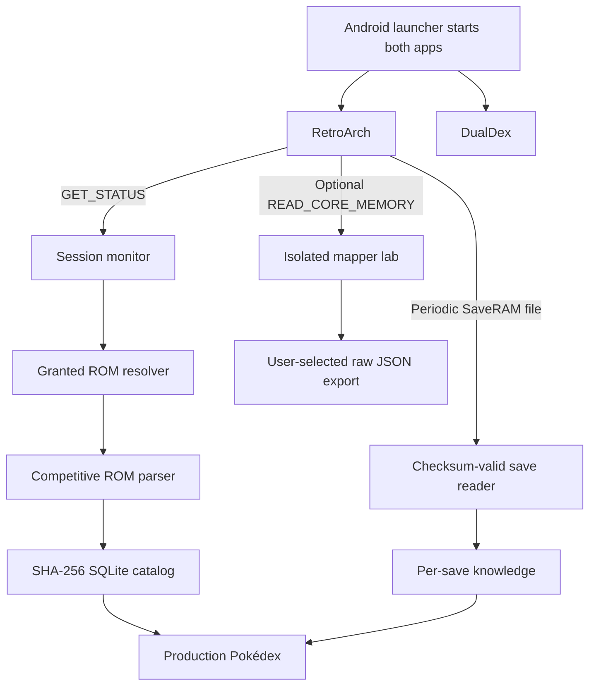

# DualDex

DualDex is a passive Pokédex companion for mainline-family Pokémon games running in RetroArch on Android handhelds. It supports a normal docked activity for dual-screen devices and an optional floating overlay for single-screen play.

The game remains on the primary display. DualDex detects the active GB, GBC, or GBA content, parses the user's ROM into a local SQLite Pokédex, and refreshes seen/caught/team/area knowledge from checksum-valid SaveRAM. It does this without OCR, screenshots, cheats, memory writes, or per-hack profiles. A separately isolated Memory Mapper Lab can collect read-only evidence for future live battle mapping, but its dumps never feed the production Pokédex.

> [!IMPORTANT]
> The pure-Kotlin ROM parser, materialized SQLite catalog, Gen I–III SaveRAM readers, save-backed knowledge, loopback web host, Thor-first UI, passive RetroArch activation, Docked/Overlay modes, and isolated read-only Memory Mapper Lab are implemented. The inherited OCR/accessibility application has been replaced. GitHub-signed RC6 has passed the dedicated-AVD update and overlay gates and is available as a public prerelease for Thor validation; stable `v1.0.0` has not been released.

## Thor-first UI direction

DualDex targets the AYN Thor's 3.92-inch lower display as a physically small companion surface, not as a high-resolution tablet. Browsing and species details are separate pages, battle tabs show one question at a time, and redundant global bottom navigation is omitted. Settings stay in the header; battle context opens and closes automatically.

<p align="center">
  
  
  
</p>

<p align="center">
  
  
</p>

These are production-UI screenshots from the packaged Android debug APK at the 406 × 354 reference viewport, using a streamed Modern Emerald 3.5 ZIP. Every shown Pokémon name, sprite, entry, type, type color, move, and move description comes from that ROM's parsed catalog. No emoji, bundled Pokédex database, or synthetic Pokémon artwork is used.

## Why this fork is different

The upstream project attempted to identify Pokémon from screenshots and supply game data through bundled databases or user-authored CSV profiles. This fork treats the ROM and live game state as authoritative.

| Concern | Previous OCR approach | DualDex direction |
| --- | --- | --- |
| Opponent detection | Repeated screenshots and text recognition | Future validated species/form ID from isolated RetroArch memory mapping |
| Game data | Bundled database and imported CSV profiles | Parsed directly from the active ROM |
| ROM hacks | User creates and maintains a profile | Family competition, structural inference, and automatic generated mapping |
| Type mechanics | Selected external generation chart | Type chart and move mechanics extracted from the ROM |
| Double battles | Infer names from screen regions | Follow the game's selected target cursor |
| Opponent moves | OCR or generic expectations | For uncaught species/forms, only moves actually observed, ranked by use frequency; captured entries need no observation metric |
| Permissions | Accessibility and screenshot access | Localhost RetroArch Network Commands plus one Android All files access grant for multi-folder ROM and SaveRAM discovery |
| Failure behavior | OCR/profile tuning | Independent capability flags; static Pokédex remains usable |

The product contract is simple: a player may need to enable RetroArch Network Commands once, but must never have to enter memory addresses, import cheat codes, prepare CSV files, or create a profile for every mod.

## Companion experience

### Full Pokédex

Outside battle, DualDex is a fully navigable Pokédex built from the active ROM. It can expose every validated species, form, type, stat, sprite, description, evolution, move, learnset, ability, ability description, and type-chart entry that exists in that game. Moves and abilities open focused detail pages instead of making the small lower-screen layout dense. The Stats tab keeps each ROM base stat visible and adds a compact Level 50, zero-training IV/DV projection: a blue typical reference with red/green low/high variance and the resulting numeric range. Organic mode lists only species the player has seen or captured; for an uncaptured species, Entry explains the knowledge lock, Stats and More are disabled, and Moves contains only attacks that species has actually used against the player, frequency-ranked without revealing ROM learn levels or acquisition methods. Capture unlocks every static tab and the complete learnset. Discovered mode may expose the complete ROM index with unseen entries clearly marked. Capability-gated Team and Area filters help the player inspect the current party and track uncaptured species available at the current location. Where the save format records it, a captured marker uses the ROM's artwork for the ball belonging to the best-IV/DV owned individual of that species; otherwise it uses the game's generic Poké Ball artwork without claiming a capture-ball type.

### Automatic battle target (after 1.0.0)

The UI contract is already designed and exercised by the developer simulator, but live battle pages are deliberately not part of 1.0.0. The first release remains a complete ROM- and SaveRAM-backed Pokédex while the isolated mapper gathers evidence. Once a battle mapping is independently validated, the companion can open the current opponent automatically, follow the move-target cursor in double battles, and return to out-of-combat navigation when battle ends.

The hybrid target page has four focused tabs:

1. **Entry** — ROM-derived Pokédex information filtered by seen/caught knowledge.
2. **Attack** — the selected move's globally known metadata plus its discovered effectiveness against the current target.
3. **Rarity** — a qualitative recruitment signal based on relative level and average DV/IV quality.
4. **Moves** — for an uncaught target, previously observed moves ranked by use frequency with complete ROM-derived move details. Once captured, the frequency metric disappears and the linked Pokédex supplies the complete ROM learnset.

The current opponent's unrevealed four-move loadout is never read into the presentation model.

### Information policies

The parser knows the complete ROM, but the UI controls how much of that truth it reveals.

| Policy | Behavior |
| --- | --- |
| `Discovered` | Expose the complete validated ROM index, clearly mark unseen species, and show deterministic static information immediately. |
| `Organic` (default) | List only seen/caught species, remember facts learned through battle, and unlock complete static species knowledge after capture. |
| `Hidden` | Keep manual Pokédex access but hide battle assistance beyond minimal target identity and caught state. |

In 1.0.0, Organic knowledge comes from checksum-valid SaveRAM. The later battle mapper will add observed moves and matchup discoveries only after a qualifying interaction. DualDex will compute the result from the parsed move, active type chart, and validated live battler context; it will not infer effectiveness from HP loss. Once a species is captured, its static Pokédex becomes omniscient.

### Recruitment-oriented rarity

The post-1.0.0 Rarity tab is intended to answer a practical question: **is this individual worth capturing?** It does not expose exact DVs/IVs and does not include EVs, Stat Experience, encounter rate, capture probability, or trainer importance. The same innate tier can already describe a save-owned individual when its validated DV/IV data is available.

Its label has two independent parts:

- a contextual level prefix relative to the median level of the player's party; and
- a stable innate tier derived from average IVs, or normalized DVs in Generations I/II.

Examples include `WEAK ACE`, `ORDINARY TRAINED`, and `STRONG STANDARD`—an under-levelled Pokémon can still have exceptional innate potential.

| Relative level | Prefix |
| ---: | --- |
| `-3` or lower | `WEAK` |
| `-2` through `+1` | `ORDINARY` |
| `+2` through `+3` | `COMPETENT` |
| `+4` through `+5` | `STRONG` |
| `+6` or higher | `MAJOR` |

| Average Gen III IV | Innate tier |
| ---: | --- |
| `0–9` | `FODDER` |
| `10–17` | `STANDARD` |
| `18–23` | `TRAINED` |
| `24–27` | `VETERAN` |
| `28–29` | `ELITE` |
| `30–31` | `ACE` |

The qualitative label is deliberately visible before capture in Organic mode because it exists to support recruitment decisions.

### Readable, configurable lower screen

The selected UI direction is a hybrid of full Pokédex navigation and automatic battle context. Each tab has one job instead of cramming every detail onto one screen.

The production settings include:

- `Discovered`, `Organic`, and `Hidden` information policies;
- independent Attack, Rarity, and Observed Moves switches;
- font-size controls;
- `Auto` density by default, with `Comfortable` and `Compact` overrides;
- high contrast;
- automatic target opening and independent Attack, Rarity, and Observed Moves switches for the later live mapper;
- `Docked` or `Overlay` display mode, with Docked as the default.

They also include Game/Dark/Light themes, Auto/Handheld/External display targeting, ruleset selection, scoped catalog maintenance, RetroArch setup/status, SaveRAM diagnostics, and mapper-session controls. Controller navigation and user-resizable overlay panels remain later work.

Auto density responds to usable display size and Android font scale. It may wrap or scroll secondary content, but it may not make target identity, caught state, or the selected-attack result unreadably small.

## Zero-profile architecture



Official layouts provide fast paths, not a compatibility ceiling. The production parser competes family-compatible ROM structures and independently validates each static dataset. Later, the battle mapper can apply the same principle to ROM references and live-memory invariants, caching only mappings supported by repeated evidence.

An internal generated mapping is not a player profile. It is automatically produced, revalidated, and discarded when the ROM, core, or schema changes.

If a modified engine exposes only part of its familiar structure, capabilities degrade independently:

- a parsed Pokédex can work without battle mapping;
- opponent identity can work without automatic double-battle targeting;
- innate rarity can work without matchup context; and
- unknown or conflicting values are withheld rather than guessed.

There is no OCR fallback.

## What is implemented now

The release candidate contains:

- `parser-core`: a pure-Kotlin, Android-portable ROM parser;
- `parser-cli`: a read-only corpus scanner and report generator;
- `save-core`: pure-Kotlin checksum competition and normalized SaveRAM snapshots for Generations I–III;
- `companion-core`: immutable UI state, knowledge policies, recruitment ranking, and best-owned-individual selection;
- `companion-simulator`: deterministic one- or two-opponent battles using only level-plausible moves from the parsed learnsets;
- `companion-server`: a loopback-only HTTP/SSE gateway with direct-ROM and streaming-ZIP loading plus on-demand ROM sprite PNGs;
- `companion-web`: the packaged Preact/TypeScript Thor UI plus a development-only plausible encounter simulator;
- `retroarch-session`: passive Network Command status monitoring, safe configuration editing, ROM-library indexing, and active-content resolution;
- `memory-mapper-lab`: an optional read-only snapshot/diff/export subsystem that has no production-state output;
- `app`: the replacement Android host with packaged web assets, per-ROM SQLite catalogs, setup wizard, normal Docked mode, and an opt-in floating Poké Ball that toggles the same UI in an automatically fitted 4:3 overlay;
- competitive family parsers for Red/Blue, Yellow, Gold/Silver, Crystal, Ruby/Sapphire, Emerald, and FireRed/LeafGreen;
- dynamic structural resolution for common relocated and expanded Gen III layouts;
- direct ROM and streamed ZIP-entry inputs through the same parser contract;
- progressive background materialization that publishes navigable catalog snapshots before slower extended datasets complete;
- resident runtime-selectable learnset variants, with `Auto` plus diagnostic manual selection and no ROM reparse when switching;
- materialized species, forms, types, stats, sprites, descriptions, evolutions, moves, move descriptions, normalized learnsets, abilities, ability descriptions, encounters, type presentation, type matchups, and capture-ball artwork;
- independent tri-state capability evidence (`AVAILABLE`, `NOT_FOUND`, `NOT_APPLICABLE`);
- checksum-valid per-ROM SaveRAM snapshots persisted in the catalog database, including seen/caught, Team, Area, preferred individual, IV/DV quality, and capture-ball provenance where applicable;
- Discovered, Organic, and Hidden presentation policies; and
- human-readable and machine-readable compatibility reports.

The private in-scope corpus result is:

- **14 inputs evaluated**;
- **11 exact official matches**;
- **3 structurally selected derivatives**: Modern Emerald 3.5, Sword and Shield Ultimate Plus, and Pokémon Unbound;
- **14 complete core catalogs**;
- **14 complete for every applicable extended dataset**;
- **0 ambiguous and 0 parse errors**; and
- no applicable `N/F` capability cells in the current corpus report.

Move and ability descriptions validate for every sampled GBA ROM and are correctly `N/A` where the older engine does not contain those tables. Egg moves validate for Generations II and III, and machine compatibility validates for all 14 samples. Tutor compatibility validates for Crystal, Emerald, FireRed/LeafGreen, and the three derivatives; it is correctly `N/A` for Generation I, Gold/Silver, and Ruby/Sapphire, whose move relearner is already represented by the level-up learnset rather than a separate tutor-compatibility table. Spin-offs such as Pinball, Trading Card Game, Puzzle Challenge, and Mystery Dungeon are excluded from the v1 mainline-family report.

Numeric ability mechanics are tracked separately from descriptions. The implemented ROM-code resolver validates the compiled threshold, multiplier, ability IDs, and type IDs for Overgrow, Blaze, Torrent, and Swarm before exposing `HP <= 1/3` and `x1.5` type-matched move power. It resolves those four abilities in every sampled GBA ROM, including the three derivatives. Other abilities remain description-only unless their exact mechanics are independently resolved; DualDex never substitutes familiar series values for unvalidated ROM behavior.

Read the named evidence in the [Markdown compatibility report](reports/dualdex-parser-compatibility.md) or inspect the complete [JSON report](reports/dualdex-parser-compatibility.json). Reports contain structural evidence and hashes, but no decoded Pokédex text, sprites, or ROM bytes.

SaveRAM evidence is reported separately for [Generations I/II](docs/reports/gen1-gen2-saveram-compatibility.md) and [Generation III](docs/reports/gen3-saveram-compatibility.md). These reports contain no ROM/save bytes, trainer data, or private filesystem paths.

## Project status

| Area | Status |
| --- | --- |
| Static GB/GBC/GBA ROM parser | Implemented and corpus-validated |
| Direct and streamed ZIP input | Implemented |
| Decoded `ParsedCatalog` materialization | Implemented |
| Progressive partial-catalog loading | Implemented in the Android runtime with `Loading... (N%)` state |
| Per-ROM SQLite catalog cache | Implemented and reopen-validated on Android |
| Species and capture-ball sprite decoding | Implemented without AWT/Android dependencies |
| Area encounters, type colors, and type chart | Implemented and reported independently |
| Ability descriptions and focused detail pages | Implemented for validated ROMs |
| Numeric ability mechanics | Implemented for four code-validated pinch abilities; unresolved abilities remain description-only |
| Packaged production UI | Implemented and exact-viewport browser/WebView validated |
| Browser-hosted plausible simulator | Retained as a development harness; absent from production assets |
| Loopback HTTP companion server | Implemented and bound only to `127.0.0.1` |
| Runtime memory transport | Implemented as an optional read-only RetroArch adapter; not consumed by the Pokédex |
| Dynamic battle-memory mapper | Labeled capture/diff/export lab implemented; production battle mappings are deferred until separately validated |
| SaveRAM readers and Organic discovery ledger | Implemented and persisted per ROM/save for Generations I–III; live battle observations remain deferred |
| Thor-first companion UI and settings | Implemented in the packaged Android companion |
| Passive RetroArch active-ROM activation | Implemented and live-validated against current nightly NCI responses; identical SHA-256 copies resolve deterministically |
| Multi-folder ROM/config/SaveRAM storage | Implemented with Android All files access; SAF folder grants remain fallbacks |
| Optional Docked / 4:3 Overlay Android display modes | Implemented and GitHub-signed RC6 validated on the dedicated AVD |
| Replacement of inherited OCR Android app | Implemented through the current staged Android host |
| Public signed candidate | [`v1.0.0-rc.6`](https://github.com/Darkaxt/DualScreenDex/releases/tag/v1.0.0-rc.6) prerelease; stable `v1.0.0` remains gated on Thor validation |

## Parser development

Requirements:

- JDK 17
- the included Gradle wrapper

Run the parser tests and install the CLI distribution on Windows:

```powershell
.\gradlew.bat :parser-core:test :parser-cli:test :parser-cli:installDist
```

Scan one or more user-owned ROM directories read-only:

```powershell
.\parser-cli\build\install\parser-cli\bin\parser-cli.bat `
  "D:\path\to\roms" `
  --json "D:\path\to\report.json" `
  --markdown "D:\path\to\report.md"
```

The scanner accepts `.gb`, `.gbc`, and `.gba` files plus matching entries inside ZIP archives. ZIP contents are decompressed directly into the parser without extracting temporary ROM files.

## Run the browser development harness

Requirements:

- JDK 17
- Node.js 20 or newer

Build the web client and install the local server distribution:

```powershell
Set-Location companion-web
npm install
npm test
npm run build
Set-Location ..
.\gradlew.bat :companion-server:test :companion-server:installDist
```

Start the passive loopback server with a direct ROM or ZIP path:

```powershell
.\companion-server\build\install\companion-server\bin\companion-server.bat `
  --rom "D:\path\to\pokemon-rom.zip" `
  --web-root "companion-web\dist"
```

Open `http://127.0.0.1:47831`. Opening `companion-web/index.html` directly is not supported because the UI requires the local catalog API. The development-only left panel shows the loaded archive/inner-ROM identity and can generate deterministic plausible encounters. The packaged Android production build omits that simulator panel. Neither path writes to the ROM.

## Android setup and release identity

The in-app **RetroArch Setup** page requests Android All files access once so sibling GB/GBC/GBA folders and RetroArch SaveRAM can be discovered without selecting every console directory. It locates the public `RetroArch/retroarch.cfg`, explains the exact Network Commands and 10-second SaveRAM autosave settings, edits only those approved keys, verifies the saved file, and requests one RetroArch restart only when the file changed. Existing Storage Access Framework folder actions remain available as fallbacks. ROMs and saves are read-only; the public config and its short-lived verified recovery sibling are the only storage writes. If automatic activation is unavailable, manual ROM selection and the last valid cached catalog remain usable.

Production uses package `com.darkaxt.dualdex`; debug builds use `com.darkaxt.dualdex.debug` so they can coexist. Production APKs are signed only by the protected GitHub release workflow. The pinned certificate SHA-256 is [`C5A02CECB47CDA41B618817EA684CBB6CCFDCC17A3E7D8243448175C8E3B2FBA`](signing/dualdex-release-cert.sha256); the repository contains the public certificate but no keystore or credentials.

## Android display modes

Settings exposes `Docked` and `Overlay`. Docked is the default and uses the normal Android activity. Overlay is explicitly user-enabled, requests Android's `Display over other apps` permission, and moves DualDex into a foreground service with a draggable Poké Ball rendered from the active ROM. Tapping the ball shows or hides the same companion in an automatically fitted 4:3 panel while RetroArch remains focused; choosing Docked removes both overlay windows and returns to the normal activity. The v1 panel is not user-resizable. The overlay remains passive and never injects input or changes emulator state.

Settings also persists the information policy, ruleset, font scale, density, theme, and companion-display target. `Auto` preserves the screen selected by the launcher; `Handheld` requests Android's default display and `External` requests a presentation/non-default display when one exists.

## Optional Memory Mapper Lab

The debug lab starts disabled on every app process. Enabling it is the single privacy confirmation for that session, opens an independent localhost UDP client, and permits only RetroArch `READ_CORE_MEMORY` commands. Disabling or failing the lab cannot unload or mutate the active catalog, SaveRAM snapshot, or discovery ledger.

Each session can label bounded snapshots as Overworld, Battle Start, Move Selected, Move Executed, Target Changed, Opponent Switched, Battle End, or a custom event. The user-selected JSON export includes core/content identity, descriptors, timestamps, region hashes, Base64 memory bytes, and bounded address-level before/after diffs. These are evidence—not automatically validated field mappings. A battle address becomes a generated mapping only after repeated captures and structural checks agree.

The first labeled Modern Emerald battle analysis is recorded in [the battle-memory mapper report](docs/reports/modern-emerald-memory-mapper-analysis.md). It validates the single-opponent record, level and IV tier, highlighted player move, ROM-derived effectiveness, and Organic opponent move-frequency counts from PP decreases. Production consumption is still capability-gated and is not enabled in the 1.0 SaveRAM release; double-target hover and battle-exit detection need their own labeled evidence.

## Design documents

- [DualDex v1 passive companion specification](docs/superpowers/specs/2026-08-09-dualdex-v1-passive-companion-design.md)
- [DualDex first-release specification](docs/superpowers/specs/2026-08-09-dualdex-first-release-design.md)
- [v1 requirement matrix](docs/v1-requirement-matrix.md)
- [Web UI and plausible simulator POC specification](docs/superpowers/specs/2026-08-09-dualdex-web-ui-simulator-poc-design.md)
- [ROM parser and passive companion foundation](docs/superpowers/specs/2026-08-08-dualdex-rom-parser-companion-design.md)
- [Parser compatibility report](reports/dualdex-parser-compatibility.md)

## Relationship to Kanto Gear

[Kanto Gear](https://github.com/AverageConsumer/kanto-gear) demonstrates how well a contextual companion can use a handheld's second screen. DualDex takes inspiration from its single-purpose pages, automatic battle context, return-to-browsing flow, themes, information levels, display selection, and optional controller navigation.

The architecture is different. Kanto Gear integrates deeply with Gen1Recomp and can move game controls and UI between displays. DualDex is a separate passive Android companion for RetroArch, targets multiple GB/GBC/GBA engine families, and never controls the game. No Kanto Gear code or artwork is included here.

## Privacy and safety

- ROM parsing, memory reads, catalogs, generated mappings, and discovery history remain local.
- DualDex uses only status and read-memory commands on localhost.
- It does not upload ROMs, saves, screenshots, extracted assets, or memory samples.
- It never sends write-memory, cheat, input, save-state, or content-control commands.
- Sanitized parser diagnostics contain structural metadata and validation outcomes, not ROM bytes or private save content.
- Raw mapper sessions are exported only through an explicit user-selected document after the lab has been enabled; they are never attached to CI reports or releases.
- Android cloud backup is disabled so private catalogs, save-derived state, and mapper sessions remain on the device unless the user explicitly exports a mapper document.

## Release engineering

Production APKs are signed only by the protected GitHub `release-signing` environment. A release run must start from a new `v1.*` source tag, completes all non-secret tests before the signing job can access the keystore, verifies the pinned certificate fingerprint before and after signing, and creates a non-replacing GitHub Release with checksums and provenance. Local Gradle release builds remain unsigned.

Downloaded candidates are independently checked with `tools/android/validate-signed-candidate.ps1` before installation. The tool validates SHA-256, `com.darkaxt.dualdex`, version name/code, and signer fingerprint, and requires an explicit `-Install` switch plus a named `DedicatedAvd` or `Thor` target.

## Project lineage and license

This work is based on [Enrique Paulino's original DualScreenDex project](https://github.com/enrique-paulino/DualScreenDex). The repository remains available under the [MIT License](LICENSE).

DualDex is an unofficial, free fan project. It is not affiliated with or endorsed by Nintendo, Game Freak, The Pokémon Company, RetroArch, Libretro, Kanto Gear, or the referenced ROM-hack projects. Pokémon and related names belong to their respective owners.
