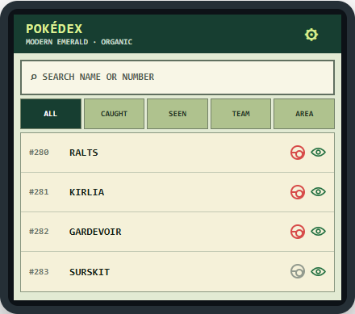
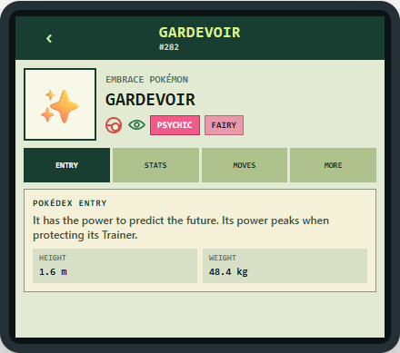
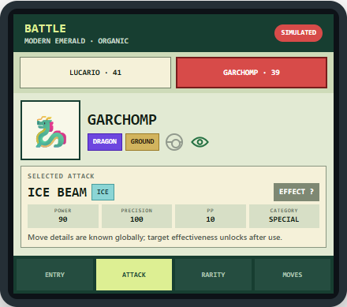
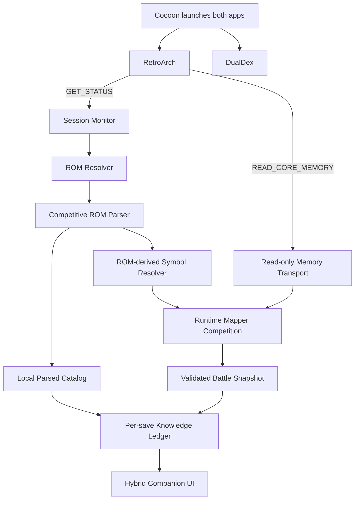

# DualDex

DualDex is becoming a passive second-screen Pokédex companion for mainline-family Pokémon games running in RetroArch on dual-screen Android handhelds.

The game remains on the primary display. DualDex parses the user's active GB, GBC, or GBA ROM into a local Pokédex, observes battle state through RetroArch's read-only memory interface, and presents the currently targeted opponent on the companion screen—without OCR, screenshots, cheats, memory writes, or per-ROM profiles.

> [!IMPORTANT]
> The pure-Kotlin ROM parser proof of concept is implemented and validated. The passive runtime mapper and replacement companion UI are specified but not implemented yet. The inherited `app` module is still the abandoned OCR/accessibility prototype and is not representative of the new v1 architecture. There is no new companion APK release at this stage.

## Thor-first UI direction

DualDex targets the AYN Thor's 3.92-inch lower display as a physically small companion surface, not as a high-resolution tablet. Browsing and species details are separate pages, battle tabs show one question at a time, and redundant global bottom navigation is omitted. Settings stay in the header; battle context opens and closes automatically.

<p align="center">
  
  
  
</p>

These are browser-rendered design artifacts, not screenshots of an implemented APK. Sprites are synthetic placeholders and the shown type colors illustrate the ROM/family-palette direction; production data will come from the user's parsed ROM.

## Why this fork is different

The upstream project attempted to identify Pokémon from screenshots and supply game data through bundled databases or user-authored CSV profiles. This fork treats the ROM and live game state as authoritative.

| Concern | Previous OCR approach | DualDex direction |
| --- | --- | --- |
| Opponent detection | Repeated screenshots and text recognition | Validated species/form ID from RetroArch memory |
| Game data | Bundled database and imported CSV profiles | Parsed directly from the active ROM |
| ROM hacks | User creates and maintains a profile | Family competition, structural inference, and automatic generated mapping |
| Type mechanics | Selected external generation chart | Type chart and move mechanics extracted from the ROM |
| Double battles | Infer names from screen regions | Follow the game's selected target cursor |
| Opponent moves | OCR or generic expectations | Only moves actually observed, frequency-ranked per species/form |
| Permissions | Accessibility and screenshot access | Localhost RetroArch Network Commands and user-selected ROM access |
| Failure behavior | OCR/profile tuning | Independent capability flags; static Pokédex remains usable |

The product contract is simple: a player may need to enable RetroArch Network Commands once, but must never have to enter memory addresses, import cheat codes, prepare CSV files, or create a profile for every mod.

## Planned v1 experience

### Full Pokédex

Outside battle, DualDex is a fully navigable Pokédex built from the active ROM. It can expose every validated species, form, type, stat, sprite, description, evolution, move, learnset, ability, and type-chart entry that exists in that game. Organic mode lists only species the player has seen or captured; Discovered mode may expose the complete ROM index with unseen entries clearly marked. Capability-gated Team and Area filters help the player inspect the current party and track uncaptured species available at the current location. Where the save format records it, a captured marker uses the ROM's artwork for the ball belonging to the best-IV/DV owned individual of that species; otherwise it uses the game's generic Poké Ball artwork without claiming a capture-ball type.

### Automatic battle target

In battle, the companion opens the current opponent automatically. In double battles, large opponent buttons represent every target and the selected button follows the game's move-target cursor. When battle ends, the companion returns to out-of-combat Pokédex navigation.

The hybrid target page has four focused tabs:

1. **Entry** — ROM-derived Pokédex information filtered by seen/caught knowledge.
2. **Attack** — the selected move's globally known metadata plus its discovered effectiveness against the current target.
3. **Rarity** — a qualitative recruitment signal based on relative level and average DV/IV quality.
4. **Moves** — previously observed moves, frequency-ranked with complete ROM-derived move details.

The current opponent's unrevealed four-move loadout is never read into the presentation model.

### Information policies

The parser knows the complete ROM, but the UI controls how much of that truth it reveals.

| Policy | Behavior |
| --- | --- |
| `Discovered` | Expose the complete validated ROM index, clearly mark unseen species, and show deterministic static information immediately. |
| `Organic` (default) | List only seen/caught species, remember facts learned through battle, and unlock complete static species knowledge after capture. |
| `Hidden` | Keep manual Pokédex access but hide battle assistance beyond minimal target identity and caught state. |

In Organic mode, testing an attack against an uncaught species records the matchup only when the move reaches a qualifying interaction. DualDex computes the result from the parsed move, active type chart, and validated live battler context; it does not try to infer effectiveness from HP loss. Once that species is captured, its static Pokédex becomes omniscient.

### Recruitment-oriented rarity

The Rarity tab is intended to answer a practical question: **is this individual worth capturing?** It does not expose exact DVs/IVs and does not include EVs, Stat Experience, encounter rate, capture probability, or trainer importance.

Its label has two independent parts:

- a contextual level prefix relative to the median level of the player's party; and
- a stable innate tier derived from average IVs, or normalized DVs in Generations I/II.

Examples include `WEAK ACE`, `ORDINARY TRAINED`, and `STRONG STANDARD`—an under-levelled Pokémon can still have exceptional innate potential.

| Relative level | Prefix |
| ---: | --- |
| `-3` or lower | `WEAK` |
| `-2` through `+1` | `ORDINARY` |
| `+2` through `+3` | `COMPETENT` |
| `+4` through `+5` | `STRONG` |
| `+6` or higher | `MAJOR` |

| Average Gen III IV | Innate tier |
| ---: | --- |
| `0–9` | `FODDER` |
| `10–17` | `STANDARD` |
| `18–23` | `TRAINED` |
| `24–27` | `VETERAN` |
| `28–29` | `ELITE` |
| `30–31` | `ACE` |

The qualitative label is deliberately visible before capture in Organic mode because it exists to support recruitment decisions.

### Readable, configurable lower screen

The selected UI direction is a hybrid of full Pokédex navigation and automatic battle context. Each tab has one job instead of cramming every detail onto one screen.

Planned settings include:

- `Discovered`, `Organic`, and `Hidden` information policies;
- independent Attack, Rarity, and Observed Moves switches;
- game-matching and accessible themes;
- font-size controls;
- `Auto` density by default, with `Comfortable` and `Compact` overrides;
- `Auto`, `Handheld`, and `External` display targeting where supported;
- automatic target opening and caught-marker switches;
- optional last-tab memory and controller-trigger navigation; and
- local discovery reset, cache rebuild, remapping, and sanitized diagnostics.

Auto density responds to usable display size and Android font scale. It may wrap or scroll secondary content, but it may not make target identity, caught state, or the selected-attack result unreadably small.

## Zero-profile architecture



Official layouts provide fast paths, not a compatibility ceiling. For a derived ROM, DualDex locates battle references from ROM code, competes plausible family-compatible structures, validates candidates against live battle invariants, and caches the successful mapping by ROM hash and core-memory fingerprint.

An internal generated mapping is not a player profile. It is automatically produced, revalidated, and discarded when the ROM, core, or schema changes.

If a modified engine exposes only part of its familiar structure, capabilities degrade independently:

- a parsed Pokédex can work without battle mapping;
- opponent identity can work without automatic double-battle targeting;
- innate rarity can work without matchup context; and
- unknown or conflicting values are withheld rather than guessed.

There is no OCR fallback.

## What is implemented now

The current proof of concept contains:

- `parser-core`: a pure-Kotlin, Android-portable ROM parser;
- `parser-cli`: a read-only corpus scanner and report generator;
- competitive family parsers for Red/Blue, Yellow, Gold/Silver, Crystal, Ruby/Sapphire, Emerald, and FireRed/LeafGreen;
- dynamic structural resolution for common relocated and expanded Gen III layouts;
- direct ROM and streamed ZIP-entry inputs through the same parser contract;
- independent tri-state capability evidence (`AVAILABLE`, `NOT_FOUND`, `NOT_APPLICABLE`); and
- human-readable and machine-readable compatibility reports.

The private in-scope corpus result is:

- **14 inputs evaluated**;
- **11 exact official matches**;
- **3 structurally selected derivatives**: Modern Emerald 3.5, Sword and Shield Ultimate Plus, and Pokémon Unbound;
- **14 complete for every applicable static dataset**;
- **0 partial, 0 ambiguous, and 0 parse errors**; and
- **67 automated tests with no failures, errors, or skips**.

Abilities are correctly `N/A` for GB/GBC rather than reported as missing. Spin-offs such as Pinball, Trading Card Game, Puzzle Challenge, and Mystery Dungeon are excluded from the v1 mainline-family report.

Read the named evidence in the [Markdown compatibility report](reports/dualdex-parser-compatibility.md) or inspect the complete [JSON report](reports/dualdex-parser-compatibility.json). Reports contain structural evidence and hashes, but no decoded Pokédex text, sprites, or ROM bytes.

## Project status

| Area | Status |
| --- | --- |
| Static GB/GBC/GBA ROM parser | Implemented and corpus-validated |
| Direct and streamed ZIP input | Implemented |
| Decoded `ParsedCatalog` materialization | Designed, not implemented |
| Area encounter-table and type-palette capabilities | Newly specified, not part of the current 14-capability report |
| Browser-hosted UI and plausible simulator | Designed, not implemented |
| Runtime memory transport | Specified, not implemented |
| Dynamic battle-memory mapper | Specified, not implemented |
| Organic discovery ledger | Specified, not implemented |
| Thor-first companion UI and settings | Specified, not implemented |
| Replacement of inherited OCR Android app | Not implemented |
| Public v1 APK | Not released |

## Parser development

Requirements:

- JDK 17
- the included Gradle wrapper

Run the parser tests and install the CLI distribution on Windows:

```powershell
.\gradlew.bat :parser-core:test :parser-cli:test :parser-cli:installDist
```

Scan one or more user-owned ROM directories read-only:

```powershell
.\parser-cli\build\install\parser-cli\bin\parser-cli.bat `
  "D:\path\to\roms" `
  --json "D:\path\to\report.json" `
  --markdown "D:\path\to\report.md"
```

The scanner accepts `.gb`, `.gbc`, and `.gba` files plus matching entries inside ZIP archives. ZIP contents are decompressed directly into the parser without extracting temporary ROM files.

## Design documents

- [DualDex v1 passive companion specification](docs/superpowers/specs/2026-08-09-dualdex-v1-passive-companion-design.md)
- [Web UI and plausible simulator POC specification](docs/superpowers/specs/2026-08-09-dualdex-web-ui-simulator-poc-design.md)
- [ROM parser and passive companion foundation](docs/superpowers/specs/2026-08-08-dualdex-rom-parser-companion-design.md)
- [Parser compatibility report](reports/dualdex-parser-compatibility.md)

## Relationship to Kanto Gear

[Kanto Gear](https://github.com/AverageConsumer/kanto-gear) demonstrates how well a contextual companion can use a handheld's second screen. DualDex takes inspiration from its single-purpose pages, automatic battle context, return-to-browsing flow, themes, information levels, display selection, and optional controller navigation.

The architecture is different. Kanto Gear integrates deeply with Gen1Recomp and can move game controls and UI between displays. DualDex is a separate passive Android companion for RetroArch, targets multiple GB/GBC/GBA engine families, and never controls the game. No Kanto Gear code or artwork is included here.

## Privacy and safety

- ROM parsing, memory reads, catalogs, generated mappings, and discovery history remain local.
- DualDex uses only status and read-memory commands on localhost.
- It does not upload ROMs, saves, screenshots, extracted assets, or memory samples.
- It never sends write-memory, cheat, input, save-state, or content-control commands.
- Sanitized diagnostic exports contain structural metadata and validation outcomes, not ROM bytes or private save content.

## Project lineage and license

This work is based on [Enrique Paulino's original DualScreenDex project](https://github.com/enrique-paulino/DualScreenDex). The repository remains available under the [MIT License](LICENSE).

DualDex is an unofficial, free fan project. It is not affiliated with or endorsed by Nintendo, Game Freak, The Pokémon Company, RetroArch, Libretro, Kanto Gear, or the referenced ROM-hack projects. Pokémon and related names belong to their respective owners.
