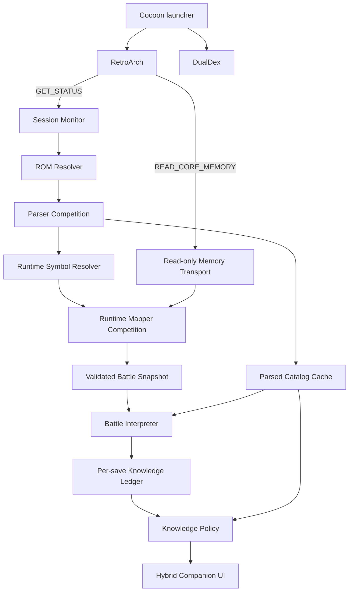

# DualDex v1 Passive RetroArch Companion Design

| Field | Value |
| --- | --- |
| Status | Approved for written-spec review |
| Date | 2026-08-09 |
| Scope | Product contract, runtime mapper, knowledge model, and companion UI for v1 |
| Builds on | [DualDex ROM Parser and Passive RetroArch Companion Design](2026-08-08-dualdex-rom-parser-companion-design.md) |

## 1. Summary

DualDex v1 is a passive second-screen companion for mainline-family Pokémon games running in RetroArch on a dual-screen Android handheld. Cocoon launches RetroArch and DualDex together. DualDex detects the active GB, GBC, or GBA ROM, parses the user's own content into a complete local catalog, derives the game's live battle-memory layout automatically, and shows contextual information for the currently targeted opponent.

The central product requirement is zero per-ROM configuration. Players do not provide addresses, cheat codes, CSV files, or hand-authored profiles. Exact official layouts may be used as fast paths, but modified games must be handled by ROM-derived address discovery, structural inference, and live validation. A successful derived layout may be cached internally by content hash; it never becomes work the user must perform.

The v1 companion combines two modes:

- a fully navigable Pokédex outside battle and whenever the user chooses to browse; and
- a live battle context with opponent targeting, Pokédex knowledge, selected-attack effectiveness, qualitative individual rarity, and observed move history.

The existing Android application is an inherited OCR prototype. This specification replaces its OCR, accessibility-service, bundled-CSV, and manual-profile direction. The completed `parser-core` and `parser-cli` modules are the first implemented foundation of the new design. The runtime mapper and replacement companion UI are specified here but are not yet implemented.

## 2. Product principles

### 2.1 Zero profiles

- A supported official game works without configuration beyond RetroArch's one-time local Network Commands setting.
- A derived game competes through the same family resolvers and runtime validators automatically.
- No failure path asks the player to enter an address or construct a profile.
- Optional diagnostics help developers improve a later release; they are never a disguised profile editor.

### 2.2 ROM-authoritative behavior

The user's ROM is the source of truth for species, names, forms, types, type charts, base stats, moves, move mechanics, learnsets, evolutions, sprites, descriptions, and abilities. DualDex does not retrofit a modern external database onto an older game or hack.

The parser may know the complete static truth while the knowledge policy intentionally withholds it from the UI. Data availability and permission to reveal data are separate concepts.

### 2.3 Passive and local

- DualDex reads the user's ROM and RetroArch memory; it does not modify either.
- Only status and read-memory commands are permitted.
- No OCR, screenshots, accessibility service, input injection, cheats, save-state control, or memory writes are used.
- ROM-derived catalogs, runtime mappings, settings, and observation history remain on device.

### 2.4 Honest partial capability

Static and runtime capabilities are validated independently. If a hack exposes a compatible Pokédex but an unfamiliar target cursor, the Pokédex remains available while automatic target selection is disabled. The UI never invents a value to make the experience appear complete.

### 2.5 Progressive knowledge

The parser is omniscient; the player experience does not have to be. Organic mode reveals uncaught opponents through encounters and actions, remembers discoveries for later encounters, and unlocks complete static species knowledge after capture.

### 2.6 Readability before density

The reference surface is the AYN Thor's physically small 3.92-inch lower screen. Browsing and species detail are separate pages, each battle tab performs one task, and the UI has no redundant global bottom bar. Auto density adapts to usable display size and Android font scale. Secondary content may wrap or scroll, but target identity, caught state, and the selected-attack result never shrink below the accessibility floor.

## 3. v1 goals

### 3.1 General Pokédex

- In Discovered mode, browse every species and form available in the active parsed ROM; in Organic mode, list only species already seen or captured.
- Search and navigate by the ROM's identifiers and names.
- Filter by All, Caught, Seen, current Team, or current Area when the relevant capabilities validate.
- Show every validated static dataset permitted by the active knowledge policy.

### 3.2 Live target context

- Open the current opponent automatically when battle begins.
- Represent every opponent in multi-battler combat.
- Follow the opponent selected by the game's move-target cursor.
- Fall back to touch selection between known opponents if automatic target mapping is unavailable.

### 3.3 Target tabs

The live target view contains four independently configurable tabs:

1. **Entry:** species/form identity, sprite, seen/caught state, types, and the ROM's Pokédex information subject to knowledge policy.
2. **Attack:** globally known metadata for the selected player move plus its effectiveness against the current target, using the active type chart and battle state.
3. **Rarity:** an at-a-glance two-part recruitment label combining contextual level strength with an average DV/IV quality tier, without exposing exact hidden values.
4. **Moves:** moves previously observed from this exact species/form, ordered by encounter frequency, with ROM-derived move details.

### 3.4 Settings

- Information policy: `Discovered`, `Organic`, or `Hidden`.
- Independent enable/disable switches for Attack, Rarity, and Observed Moves; Entry remains the battle anchor.
- Theme and game-matching presentation.
- Font size and density override, with `Auto` density as the default.
- Companion display targeting: `Auto`, `Handheld`, or `External` where the Android host exposes those choices.
- Automatic target opening, caught marker, last-tab behavior, and optional controller-trigger tab navigation.
- Local reset/export controls for discovery history, parser cache, runtime mapping, and diagnostics.

## 4. v1 non-goals

- Moving the game's menus, dialogue, party controls, or battle input to the companion display.
- Reproducing Kanto Gear's map, field tools, or deep Gen1Recomp host integration.
- Supporting non-mainline engines such as Pinball, Trading Card Game, Puzzle Challenge, or Mystery Dungeon in v1.
- Displaying the current opponent's unrevealed four-move loadout.
- Showing exact DVs, IVs, EVs, or Stat Experience in the default battle UI.
- Treating EVs, Stat Experience, level, or trainer role as part of innate rarity.
- Guaranteeing that a heavily rewritten engine exposes every live capability.
- Asking the user to repair an unsupported ROM through a profile editor.
- Bundling or redistributing ROM data, extracted descriptions, or sprites.
- Cloud accounts, telemetry, or shared discovery databases.

Mystery Dungeon remains a possible later engine family, but it does not influence the v1 architecture or compatibility report.

### 4.1 Deferred v1.1 single-screen overlay

Phones without a second display may later reuse the same companion snapshots and controls through an optional Android overlay. The v1.1 host may request the system `Display over other apps` permission, show a draggable ROM-derived Poké Ball bubble above RetroArch, and use that bubble to show or hide a compact floating DualDex panel. The overlay must remain passive: it cannot inject game input, intercept RetroArch controls outside its visible bounds, or change the ROM or emulator state. This is explicitly excluded from the v1 browser POC and first dual-screen Android host so that it does not expand their permission, lifecycle, or window-management scope.

## 5. User experience

### 5.1 First run

DualDex performs a local RetroArch connectivity probe. If Network Commands are disabled, it presents a focused one-time setup page showing the exact RetroArch setting to enable. It does not request Accessibility or screen-capture permissions.

The setup check establishes transport availability only. It does not ask for ROM-specific information.

### 5.2 Launch and content activation

1. Cocoon launches RetroArch and DualDex.
2. DualDex sends `GET_STATUS` on localhost and waits passively for supported content.
3. The content basename and CRC resolve a direct ROM or ROM entry inside a ZIP/content URI.
4. A matching parser-schema cache opens immediately; otherwise parser competition runs from the supplied stream.
5. The full Pokédex becomes available as soon as the required catalog capabilities validate.
6. Runtime symbol resolution begins from the selected engine family and parsed ROM code.

ZIP entries are decompressed directly into the parser without extracting a permanent ROM copy. The immutable parser image is materialized in memory because cross-linked ROM tables require random access.

### 5.3 Outside battle

The lower screen is a normal, fully navigable Pokédex. Its list and detail views are separate screens. Organic mode excludes completely unseen species, while Discovered mode may show them with a slashed-eye marker. All, Caught, Seen, Team, and Area filters are available when their data dependencies validate. If no game is active, DualDex may retain the most recently selected locally cached catalog. The app clearly identifies when the displayed catalog is not associated with a current RetroArch session.

### 5.4 Single battle

When a validated battle begins, the companion opens the opponent's Entry tab. Battle is a dedicated screen rather than a rail layered over the Pokédex.

### 5.5 Multiple opponents

Every opponent battler receives a target chip. The chip matching the game's current move-target cursor is selected automatically. Changing the cursor changes the companion target without waiting for move execution.

If opponent slots validate but the target cursor does not, DualDex shows the opponent chips and permits local touch selection. This affects only what the companion displays; it never sends input to the game.

### 5.6 Battle end

The battle screen closes and the companion returns to the last browsed Pokédex location. Observations already committed to the knowledge ledger remain available in future encounters.

## 6. Information policies

The active policy filters a complete parsed catalog and validated live snapshot. It does not alter parsing or runtime mapping.

| Policy | Uncaught species | Captured species | Battle assistance |
| --- | --- | --- | --- |
| `Discovered` | Include the full ROM index, mark unseen species with a slashed eye, and show validated static ROM information immediately | Show all validated static ROM information | Show every enabled deterministic matchup immediately; individual move slots remain observation-only |
| `Organic` (default) | Exclude completely unseen species from the Pokédex; show seen identity, recruitment rarity, and facts learned through qualifying encounters | Unlock all validated static information and deterministic matchups | Unknown facts remain hidden until learned; learned facts persist per save and species/form |
| `Hidden` | Show only minimal target identity and caught state | General Pokédex remains manually accessible | Hide Attack, Rarity, and Observed Moves assistance regardless of available memory |

### 6.1 Static omniscience after capture

In Organic mode, capture unlocks the complete static catalog for that species/form:

- Pokédex entry and sprite;
- types and base stats;
- evolutions and learnset;
- possible abilities;
- complete move reference; and
- every ordinary type-chart matchup that can be derived deterministically.

Capture does not reveal the current opponent individual's unrevealed move slots. The Moves tab remains an observation history rather than a memory inspection of hidden tactical information.

### 6.2 Organic matchup discovery

For an uncaught species/form:

1. A never-tested selected move displays `UNKNOWN`.
2. When the player executes a qualifying interaction, DualDex computes the intrinsic matchup from parsed move mechanics, the active type chart, current battler types, and current ability/state inputs.
3. A miss, Protect-like block, or other event that never reaches matchup resolution does not create a discovery.
4. A qualifying interaction records the computed class (`NO EFFECT`, `RESISTED`, `NEUTRAL`, or `SUPER EFFECTIVE`) rather than reverse-engineering it from HP loss.
5. Later encounters with the same species/form expose the remembered result before execution.

The result gate prevents false learning; it is not the source of matchup truth. Ability-based nullification may be displayed as `NO EFFECT — OBSERVED` without naming the ability unless the ability itself is permitted knowledge.

### 6.3 Dynamic battle mechanics

The base species types are insufficient when the battle engine changes move or battler types. The matchup resolver therefore uses an `EffectiveMoveContext` containing, when supported:

- selected move ID and effective move type;
- current target types rather than only base types;
- current ability relevant to immunity or effectiveness;
- active type-chart variant;
- weather or battle flags required by Gen I–III move mechanics; and
- a resolution gate proving that an attempted discovery reached the matchup stage.

Hidden Power, Weather Ball, Transform, Conversion, Color Change, and hack-specific extensions must either resolve through validated family logic or cause the matchup capability to withhold the answer. DualDex does not show a confident base-chart result when the active mechanic is unknown.

Modified ROMs may contain multiple valid type charts. The production catalog retains every validated variant, and the runtime mapper locates the active selector when one exists. If the active chart cannot be determined, Matchup is unavailable rather than guessed.

### 6.4 Knowledge identity

Organic discoveries are isolated by:

```text
ROM content hash + local save identity + species internal ID + form ID
```

The local save identity is derived from stable in-memory save metadata such as trainer identity and save slot/generation, then stored as a private app-local key. One player's discoveries do not leak into another save. If a stable save identity cannot be validated, DualDex uses a conservative session-local ledger and reports that persistence is unavailable.

### 6.5 Observed moves

The Moves tab stores only moves that an opponent actually executes. An encounter contributes at most once to a given move's numerator:

```text
encountered individuals of this species/form observed using the move
--------------------------------------------------------------------
total encountered individuals of this species/form
```

Moves are ordered by descending frequency, then most recently observed. Each row joins the observed move ID to the ROM-derived move catalog for name, type, power, accuracy, PP, effect, and other available details. An unseen move never appears merely because it exists in the species learnset.

Move characteristics are global within a ROM. Once a captured/player Pokémon knows a move, a captured species' unlocked learnset exposes it, the player selects it, or another qualifying observation reveals it, its static name, type, category, power, precision, PP, priority, and decoded effect metadata become available anywhere that move appears. This global `moveId` knowledge does not reveal an opponent's hidden slots. Frequency and recency remain keyed to the exact opponent species/form.

### 6.6 Qualitative rarity

Rarity is a recruitment aid: it helps the player choose which wild individuals are worth capturing. Its stable tier describes innate individual quality, while its separate prefix describes current level relative to the player's party. Neither signal measures encounter rate, capture probability, trainer importance, EV investment, or Stat Experience.

Generation III uses `floor(sum of the six validated IVs / 6)`:

| Average IV | Rarity tier |
| ---: | --- |
| `0–9` | `FODDER` |
| `10–17` | `STANDARD` |
| `18–23` | `TRAINED` |
| `24–27` | `VETERAN` |
| `28–29` | `ELITE` |
| `30–31` | `ACE` |

Generations I/II construct a five-value vector containing the derived HP DV plus Attack, Defense, Speed, and Special once. Each DV is normalized with `round(DV × 31 / 15)`, then the tier uses `floor(sum / 5)`. Counting Special once avoids giving its shared Gen I/II representation double weight.

The separate level prefix compares the opponent with the player's current party reference:

| Opponent level minus player reference | Level prefix |
| ---: | --- |
| `-3` or lower | `WEAK` |
| `-2` through `+1` | `ORDINARY` |
| `+2` through `+3` | `COMPETENT` |
| `+4` through `+5` | `STRONG` |
| `+6` or higher | `MAJOR` |

The player reference is the integer median level of non-Egg party members. For an even party count, it is the floor of the mean of the two central levels. Median avoids allowing one over-levelled carry or one deliberately under-levelled utility Pokémon to dominate the comparison. If the party reference cannot be validated, DualDex omits the prefix rather than comparing against a guessed area level.

The UI combines both axes without conflating them:

```text
WEAK ACE
ORDINARY TRAINED
STRONG STANDARD
```

The prefix is immediate and contextual: it may change as the player's party develops. The DV/IV tier is innate and stable for that individual. Neither EVs nor Stat Experience affect either label.

The UI shows only the combined qualitative label. Exact DVs/IVs remain hidden. If every required DV/IV cannot be validated, the Rarity capability is unavailable rather than estimated from level or current stats.

The combined label is deliberately available before capture in Organic mode as an appearance-derived impression. This exception serves the feature's central purpose: deciding whether to recruit the individual currently being faced. In encounters where the target cannot be captured, the same label may still be displayed when enabled, but the UI does not imply that recruitment is possible.

## 7. Companion UI

### 7.1 Thor-first navigation

The selected design combines Kanto Gear's single-purpose page rhythm with automatic DualDex battle context:

- The general Pokédex is the out-of-combat home screen.
- Pokédex browse and species detail are separate screens.
- Battle start automatically opens the current target; battle end restores the prior browse location.
- Four horizontal tabs divide target information by task and render only one task at a time.
- Large multi-opponent buttons follow the game's target cursor.
- There is no persistent target rail or global bottom navigation bar.
- Settings remain available from the header.
- Disabled or unavailable features remove their tab or filter instead of leaving an empty panel.

The companion borrows interaction principles from Kanto Gear but does not copy its code, assets, or Gen1Recomp integration.

### 7.2 Entry tab

Priority order:

1. Species/form name and sprite.
2. Seen/caught state represented by an open/slashed eye and a ROM-derived ball icon rather than text badges. When the save format preserves the capture ball, the caught icon belongs to the best innate-quality owned individual of that species/form; otherwise the game's generic Poké Ball art is used.
3. Types when permitted.
4. Pokédex description and static details when permitted.
5. Secondary navigation into evolutions, learnset, and the full move reference.

The Entry tab remains present even when every assistance feature is disabled.

### 7.3 Attack tab

The primary row contains selected move, effective type, and knowledge-filtered result. A known move also exposes its global ROM-derived power, precision, PP, physical/special/status category, priority, and effect metadata as space permits or through a move-detail drill-down. The target-specific result uses both a multiplier where meaningful and a plain-language label. Status and fixed-damage moves display a mechanic-appropriate state rather than a fictitious multiplier.

The UI distinguishes:

- `UNKNOWN`: Organic knowledge has not unlocked the fact;
- `UNAVAILABLE`: required runtime or mechanic capability did not validate; and
- `NO EFFECT`: a validated deterministic or previously observed nullification.

### 7.4 Rarity tab

The combined level prefix and innate tier dominate the page and are readable without opening numeric detail. In a capturable encounter, the tab frames them as immediate readiness and long-term recruitment potential. Exact levels may remain visible when the game itself exposes them, but exact hidden DVs/IVs are not shown. A brief explanation states that EVs, Stat Experience, encounter rate, and capture chance do not affect the label. If the mapper cannot validate every required DV/IV field, the tab is removed; if only the player party reference is unavailable, the tab retains the innate tier and omits the prefix.

### 7.5 Moves tab

The default view lists frequency, encounter count, last-seen recency, move name, and type. Selecting a move opens the complete ROM-derived move detail. An empty state says that no move has been observed from this species/form yet.

### 7.6 Ability detail

A valid ability listed in a captured species' More tab opens a focused detail page. It shows the ROM-derived name, nonzero ID, description, and captured species known to have that ability. Ability ID `0` represents no ability and is excluded at the parser boundary.

Optional structured mechanics—activation threshold, affected type/stat, multiplier, probability, duration, immunity, and target—may be shown even when the original prose omits their numbers, but only when `ABILITY_MECHANICS` validates the exact compiled battle routine and constants. This capability is independent from ability names and descriptions. Family defaults and modern-series reference values must not be presented as ROM truth. In Organic mode these complete static details unlock with capture, consistent with the omniscient captured Pokédex policy.

### 7.7 Settings page

Settings are divided into focused groups.

**Information**

- Policy: `Discovered`, `Organic`, `Hidden`; default `Organic`.
- Attack tab: on by default.
- Rarity tab: on by default.
- Observed Moves tab: on by default.
- Caught marker: on by default.

**Display**

- Theme: game-matching and accessible light/dark/classic choices.
- Font size: system-following plus explicit smaller/larger overrides.
- Density: `Auto`, `Comfortable`, `Compact`; default `Auto`.
- Gear screen: `Auto`, `Handheld`, `External` when supported.

**Navigation**

- Auto-open target: on by default.
- Remember last battle tab: off by default so Entry is the stable starting point.
- Trigger tabs: off by default to avoid controller conflicts.

**Data and diagnostics**

- Reset Organic discoveries for the active save.
- Rebuild the parsed catalog.
- Re-run runtime mapping.
- Export a sanitized diagnostic bundle.

### 7.8 Auto density

Auto density chooses a compact or comfortable layout from usable width, height, display density, system font scale, and enabled feature count. It may change spacing, card arrangement, and whether secondary text scrolls. It may not reduce required touch targets or primary text below accessibility minimums.

The UI test matrix covers dual-screen landscape displays, external displays, and large Android font scales. No layout assumes that the reference handheld's physical size is universal.

### 7.9 Type presentation and recruitment filters

Type chips use a validated ROM-extracted presentation palette when available, then a detected official-family palette, then a deterministic accessible fallback for hack-defined types. Palette source is capability evidence and never affects type mechanics.

The Pokédex filter row contains All, Caught, Seen, Team, and Area. Team depends on a validated current player party. Area intersects parsed encounter tables with the validated current map/area so the player can see which local captures remain. Unsupported Team or Area capabilities are omitted or disabled rather than guessed.

## 8. Architecture



### 8.1 Session Monitor

The monitor uses RetroArch's UDP Network Control Interface on localhost.

- `GET_STATUS` establishes playing/paused/contentless state, system ID, basename, and CRC.
- A lifecycle heartbeat detects disconnects and content changes.
- Missing heartbeat responses move the session to disconnected state; they do not crash or cancel parser work.
- A new content identity invalidates live snapshots immediately.

### 8.2 ROM Resolver and Parser Core

The existing resolver accepts direct `.gb`, `.gbc`, and `.gba` files and matching ZIP entries through one streaming input contract. The pure-Kotlin parser competes engine families, resolves every static dataset independently, and caches normalized catalogs by content hash plus parser-schema version.

### 8.3 Read-only Memory Transport

The preferred transport is `READ_CORE_MEMORY`, which uses the active core's system memory map. During startup DualDex probes the required address regions instead of assuming that a core name guarantees compatibility.

Where a core exposes achievement-address reads but not suitable system-memory descriptors, a separately capability-tested `READ_CORE_RAM` adapter may be used as a read-only fallback. DualDex never calls either write counterpart.

The transport batches contiguous fields into bounded reads. Snapshot consistency is established by reading small identity/control fields before and after each batch and discarding a sample if they changed mid-read.

### 8.4 Runtime Symbol Resolver

The symbol resolver produces candidate console addresses from the ROM itself.

**Official fast path**

Known official fingerprints seed exact battle/save layouts. Exact layouts still undergo live validation and are not trusted merely because the ROM hash matches.

**GBA-derived path**

- Identify ARM/Thumb routines that manipulate battle-active state, battler arrays, selected moves, targets, save Pokédex flags, and party data.
- Decode literal pools, absolute references, and pointer tables.
- Compete plausible ABI-aligned structure variants, including CFRU/DPE-style expansions.
- Use the static catalog's valid IDs and counts to constrain candidates.

**GB/GBC-derived path**

- Identify banked routines and WRAM references using the official disassembly families as structural anchors.
- Resolve bank-switching call shapes and fixed/high-memory variables.
- Compete family-compatible battle/save layouts without assuming original ROM offsets.

Raw binary similarity is secondary evidence only. Recompiled or expanded hacks may have low byte similarity while retaining the relevant code and data shapes.

### 8.5 Runtime Mapper Competition

Every candidate mapper emits independent capability evidence. A mapper is promoted only after multiple consistent live samples satisfy invariants such as:

- battle state transitions between inactive and active;
- battler count and side assignments are valid;
- species/form IDs resolve into the parsed catalog;
- levels, HP, stats, types, abilities, moves, and target indices fit engine ranges;
- selected move belongs to the player's mapped battler when the move menu is active;
- target changes correlate with valid opponent slots;
- executed-move transitions identify a valid attacker, target, and move; and
- seen/caught flags are internally consistent with the active save.

Conflicting candidates leave the affected capability unavailable. The system does not select the first plausible memory block.

### 8.6 Generated runtime profiles

A successful mapping is cached as an internal generated profile containing:

- ROM hash and parser/runtime schema versions;
- core identity and memory-map fingerprint;
- resolved console addresses and structure layouts;
- capability evidence and confidence;
- diagnostics required for revalidation.

Generated profiles are data, not executable plugins. They are revalidated on every launch and discarded when the ROM, core mapping, or schema changes. The player never creates, edits, imports, or selects one.

### 8.7 Battle Interpreter

The interpreter converts validated snapshots into domain events:

- battle start/end;
- opponent appearance, switch, faint, and form change;
- selected target change;
- player move selection;
- executed move and resolution gate;
- capture/seen/caught transition; and
- active type or ability change relevant to matchup calculations.

The UI and knowledge ledger never consume raw addresses.

### 8.8 Knowledge Ledger and Policy

The ledger records facts and their evidence per local save and species/form. The policy layer combines catalog truth, live facts, and the selected information mode to produce a presentation model. This boundary prevents a UI refactor from accidentally leaking parser-known information in Organic mode.

## 9. Runtime capability contract

### 9.1 Transport and session

- `RETROARCH_STATUS`
- `CONTENT_IDENTITY`
- `SYSTEM_MEMORY_READ`
- `SAVE_IDENTITY`

### 9.2 Battle state

- `BATTLE_ACTIVE`
- `BATTLER_LAYOUT`
- `OPPONENT_SPECIES_FORM`
- `MULTIPLE_OPPONENTS`
- `CURRENT_TYPES`
- `CURRENT_ABILITY_CONTEXT`
- `OPPONENT_LEVEL`
- `PLAYER_LEVEL_REFERENCE`
- `PLAYER_PARTY`
- `CURRENT_AREA`
- `OPPONENT_HP_STATUS`
- `DV_IV_QUALITY`

### 9.3 Interaction state

- `PLAYER_SELECTED_MOVE`
- `SELECTED_TARGET`
- `EXECUTED_MOVE`
- `MOVE_RESOLUTION_GATE`
- `ACTIVE_TYPE_CHART`
- `EFFECTIVE_MOVE_CONTEXT`

### 9.4 Save knowledge

- `SEEN_FLAGS`
- `CAUGHT_FLAGS`
- `OWNED_INDIVIDUALS`
- `CAPTURE_BALL_ID`

### 9.5 Feature dependencies

| Feature | Required capabilities |
| --- | --- |
| General Pokédex | static `SPECIES_CATALOG` and whichever static fields the active page renders |
| Team filter | `PLAYER_PARTY` plus static species catalog |
| Area filter | static `AREA_ENCOUNTERS` plus `CURRENT_AREA` |
| ROM-colored type chips | static `TYPE_PRESENTATION`, with detected-family or accessible fallback |
| Automatic target page | `BATTLE_ACTIVE`, `BATTLER_LAYOUT`, `OPPONENT_SPECIES_FORM` |
| Automatic double-battle target | automatic target page plus `MULTIPLE_OPPONENTS`, `SELECTED_TARGET` |
| Organic caught gating | `SAVE_IDENTITY`, `SEEN_FLAGS`, `CAUGHT_FLAGS` |
| Per-species capture-ball marker | static `BALL_CATALOG`, `OWNED_INDIVIDUALS`, `DV_IV_QUALITY`, and `CAPTURE_BALL_ID`; otherwise static generic ball art |
| Immediate static matchup | static move/types/chart plus `PLAYER_SELECTED_MOVE`, `OPPONENT_SPECIES_FORM` |
| Accurate dynamic matchup | immediate matchup plus every required current-type, ability, chart, and move-context capability |
| Organic matchup discovery | accurate matchup plus `EXECUTED_MOVE`, `MOVE_RESOLUTION_GATE` |
| Innate rarity tier | `OPPONENT_SPECIES_FORM`, `DV_IV_QUALITY` |
| Contextual level prefix | innate rarity tier plus `OPPONENT_LEVEL`, `PLAYER_LEVEL_REFERENCE` |
| Observed move frequency | `OPPONENT_SPECIES_FORM`, `EXECUTED_MOVE`, local encounter identity |

Every runtime capability has `AVAILABLE`, `NOT_FOUND`, or `NOT_APPLICABLE` state plus evidence. UI dependency resolution occurs after both static and runtime states are known.

Generation III's individual Pokémon record preserves a capture-ball field, so compatible GBA games and structurally matching hacks can provide `CAPTURE_BALL_ID`. The official Generation I and II records do not preserve the ball used to catch an individual; this capability is `NOT_APPLICABLE` there unless a hack's extended structure can be independently validated. DualDex must not infer a missing ball from inventory, animation state, met location, or species.

For each owned species/form, the presentation selector scans every validated party and storage individual. It ranks Generation III records by exact six-IV sum and Generation I/II records by the exact normalized five-value DV sum defined in section 6.4. The highest score supplies the caught marker. Ties resolve by stable storage identity, with party slots followed by box and slot order, so the chosen marker is deterministic. Level, EVs, Stat Experience, and current calculated stats never affect this selection.

## 10. Normalized runtime model

```text
RuntimeSession
  contentIdentity, coreIdentity, state
  staticCatalog, generatedRuntimeProfile
  currentArea, playerParty, ownedIndividuals
  capabilities, diagnostics

BattleSnapshot
  battleId, phase, activeTypeChart
  playerBattlers[], opponentBattlers[]
  playerLevelReference
  selectedMove, selectedTarget
  executingMove, attacker, target, resolutionGate

Battler
  slot, side, speciesId, formId
  level, hp, maxHp, status
  currentTypeIds[], currentAbilityContext
  dvIvQualityInputs

KnowledgeLedger
  romHash, saveIdentity
  speciesKnowledge[(speciesId, formId)]
  knownMoves[moveId]

SpeciesKnowledge
  seen, caught
  matchupFacts[]
  observedMoves[]
  encounteredIndividuals

PresentationTarget
  identity, caughtState, permittedEntry
  matchupState, levelPrefix, innateTier
  observedMoveRows
```

The normalized model preserves ROM-native IDs so static catalogs and live memory join without name matching.

## 11. Failure handling

### Network Commands unavailable

Show the one-time RetroArch setup page. Cached Pokédex browsing remains available. Do not fall back to OCR or Accessibility.

### Core lacks readable memory mapping

Keep the static Pokédex and identify the core-memory capability failure. Offer sanitized diagnostics. Do not ask for addresses.

### Runtime family ambiguous

Do not activate live features from a plausible but unvalidated mapper. Preserve all independent capabilities whose evidence does not conflict.

### Target cursor unavailable

Show every validated opponent and allow local touch selection. Mark automatic following unavailable.

### Caught flags unavailable

Discovered mode remains usable. Organic mode withholds uncaught-only facts conservatively and makes persistence/caught-state unavailability visible; it does not silently reveal the full catalog.

### Dynamic mechanic unavailable

Withhold Matchup for the affected state. Do not substitute base species types when the mapper has evidence that active types, ability, move type, or chart variant may differ.

### Transient inconsistent snapshot

Discard it and retain the last consistent presentation briefly. Repeated inconsistency removes only the affected runtime capability until it revalidates.

### ROM or core changes

Clear live state immediately, retain safe static caches by content hash, and begin a new session. Observation history remains isolated by ROM and save identity.

## 12. Privacy, safety, and licensing

- All reads target localhost and user-selected local content.
- No ROM, save, screenshot, catalog, or memory sample is uploaded.
- Diagnostic exports contain structural metadata, addresses, sizes, state transitions, hashes, and validation outcomes—not ROM bytes, extracted descriptions, decoded sprites, trainer names, or raw save data.
- DualDex never sends `WRITE_CORE_MEMORY`, `WRITE_CORE_RAM`, cheat, input, save-state, or content-control commands.
- The repository may use public disassemblies/decompilations and compatible source projects as structural references while keeping DualDex implementation original and respecting their licenses.
- Kanto Gear is a UI/product reference, not a code or asset dependency.

## 13. Testing strategy

### 13.1 Static parser regression

- Preserve all 67 current parser tests.
- Preserve deterministic direct-file and ZIP-entry behavior.
- Keep the 14-ROM private corpus report complete for all applicable static datasets.
- Never commit private ROM fixtures or extracted copyrighted content.

### 13.2 Runtime symbol resolver tests

- Decode synthetic GB/GBC banked-reference and GBA ARM/Thumb literal-reference fixtures.
- Test official address fast paths against independently recorded structural manifests.
- Test relocated globals, expanded battler arrays, ABI padding, false signatures, conflicting candidates, and truncated ROM code.
- Use public source layouts only as references; tests contain original minimal byte fixtures or sanitized metadata.

### 13.3 Memory transport tests

- Parse successful and failed `GET_STATUS`, `READ_CORE_MEMORY`, and optional `READ_CORE_RAM` replies.
- Test no memory map, missing descriptor, short reads, reordered/lost UDP replies, pause/resume, content replacement, and core change.
- Prove that no write command can be constructed through the production transport API.

### 13.4 Live validator tests

- Singles, doubles, target changes, switches, fainting, capture, battle end, and reconnect.
- Valid and adversarial species IDs, levels, HP, types, abilities, move IDs, IV/DV fields, and save flags.
- Mid-snapshot transitions and repeated candidate conflicts.
- Dynamic types, abilities, move types, and alternate type-chart selection.

### 13.5 Knowledge-policy tests

- Discovered reveals all eligible static facts without exposing hidden individual move slots.
- Organic begins conservatively, records only qualifying interactions, persists per save, and unlocks all static species knowledge after capture.
- Hidden suppresses assistance while preserving general manual Pokédex access.
- Misses and Protect-like blocks do not unlock a matchup.
- Ability nullification does not leak an unpermitted ability name.
- One save's knowledge never appears in another save.
- Every average-IV/DV tier boundary and relative-level prefix boundary is pinned by fixtures.

### 13.6 UI tests

- Auto, Comfortable, and Compact density.
- Exact AYN Thor lower-screen aspect, other small companion screens, external displays, and large font scales.
- No horizontal or unintended vertical overflow; only designated lists/text regions may scroll.
- Every combination of enabled/disabled tabs and unavailable capabilities.
- Long ROM-derived names and descriptions without clipping primary information.
- All, Caught, Seen, Team, and Area filter degradation.
- Global known-move metadata with independently unknown target effectiveness.
- Automatic and manual multi-opponent selection.
- Actual Cocoon + RetroArch + DualDex dual-display launch flow.

### 13.7 Device and corpus validation

At minimum, end-to-end validation covers one title from every supported official family and all three current derived GBA samples. A new mod must not require a user-authored profile. Unsupported runtime fields must degrade independently and visibly.

## 14. v1 acceptance criteria

1. A player launches an official supported ROM and reaches the general Pokédex without importing data or selecting a profile.
2. During a mapped single battle, the correct opponent opens automatically.
3. During a mapped double battle, the companion follows the game's selected target.
4. Selected-attack effectiveness uses the active ROM chart and validated live context.
5. Organic mode excludes completely unseen species from its Pokédex, withholds unknown uncaught facts, remembers qualifying discoveries, and becomes statically omniscient after capture.
6. Rarity is visible before capture as a recruitment aid: its contextual prefix uses only relative level, while its stable quality tier uses only validated average DVs/IVs.
7. The Moves tab contains only observed opponent moves and orders them by encounter frequency.
8. A known move exposes global ROM-derived power, precision, PP, category, priority, and effect metadata without revealing opponent move slots.
9. Team and Area filters appear only when their party and encounter/location dependencies validate.
10. A compatible derived ROM can generate and cache its mapping without user-created profiles.
11. A partial or failed runtime mapping leaves the static Pokédex usable and never falls back to OCR.
12. All operation remains local, passive, and read-only.
13. Auto density keeps primary information readable across the supported display/font matrix.
14. The real Cocoon dual-launch flow passes on the reference Android handheld; a cold app launch alone is insufficient evidence.

## 15. Relationship to Kanto Gear

Kanto Gear demonstrates that a dedicated lower screen can become a coherent game companion rather than a detached database. DualDex adopts these high-level lessons:

- single-purpose pages instead of one overloaded dashboard;
- automatic contextual takeover during battle;
- immediate return to normal browsing afterward;
- display, theme, information-level, and controller-navigation settings; and
- a visual language that can match the active game.

The implementation model is intentionally different. Kanto Gear is deeply integrated with Gen1Recomp and can move game input/UI to the second screen. DualDex is a separate passive Android app reading RetroArch state, covers multiple GB/GBC/GBA engine families, and never controls the game.

## 16. Current implementation status

| Area | Status on 2026-08-09 |
| --- | --- |
| Pure-Kotlin static parser | Implemented |
| Direct ROM and streamed ZIP input | Implemented |
| Static compatibility report | 14/14 complete for all applicable datasets |
| Decoded catalog materialization | Designed, not implemented |
| Area encounter-table and type-presentation capabilities | Newly specified, outside the current compatibility report |
| Runtime memory transport | Designed, not implemented |
| Dynamic runtime symbol resolver | Designed, not implemented |
| Knowledge ledger and policies | Designed, not implemented |
| Thor-first companion UI and web simulator | Designed, not implemented |
| Android replacement of OCR prototype | Not implemented |

The approved sequencing leaves memory mapping until after the rest of the product can be exercised. After written-spec review, the next implementation plan should begin with catalog materialization and the browser-hosted UI/simulator described in [DualDex Web UI and Plausible Simulator POC Design](2026-08-09-dualdex-web-ui-simulator-poc-design.md). Runtime mapping and the thin Android host follow only after that POC is accepted.

## 17. References

- [DualScreenDex upstream](https://github.com/enrique-paulino/DualScreenDex)
- [Kanto Gear](https://github.com/AverageConsumer/kanto-gear)
- [RetroArch Network Control Interface](https://docs.libretro.com/development/retroarch/network-control-interface/)
- [RetroArch `READ_CORE_MEMORY` implementation](https://github.com/libretro/RetroArch/blob/master/command.c)
- [pret Pokémon disassembly/decompilation projects](https://github.com/pret)
- [Pokémon Emerald battle structures](https://github.com/pret/pokeemerald/blob/master/include/pokemon.h)
- [Complete FireRed Upgrade](https://github.com/Skeli789/Complete-Fire-Red-Upgrade)
- [Dynamic Pokémon Expansion](https://github.com/Skeli789/Dynamic-Pokemon-Expansion)
- [Modern Emerald source](https://github.com/resetes12/pokeemerald/tree/Release3.5)
- [Parser compatibility report](../../../reports/dualdex-parser-compatibility.md)
