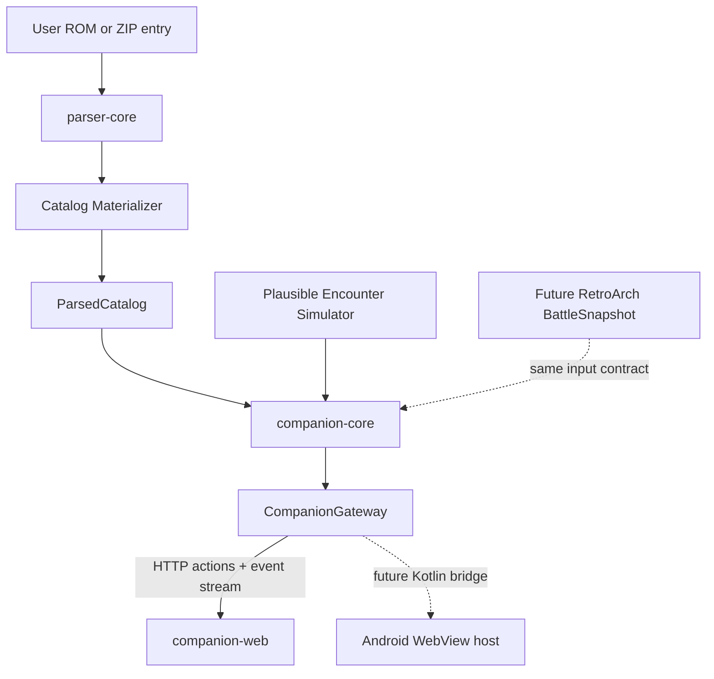

# DualDex Web UI and Plausible Simulator POC Design

| Field | Value |
| --- | --- |
| Status | Implemented and verified as a browser POC |
| Date | 2026-08-09 |
| Scope | ROM catalog materialization, web-first companion UI, knowledge policy, and development simulator |
| Excludes | RetroArch memory transport and dynamic battle-memory mapping |
| Builds on | [DualDex v1 Passive RetroArch Companion Design](2026-08-09-dualdex-v1-passive-companion-design.md) |

## 1. Outcome

This proof of concept makes the complete v1 companion experience testable before committing to the final Android host. It runs as a local web application, loads a user-owned GB, GBC, or GBA ROM through the existing Kotlin parser, materializes a usable Pokédex catalog, and drives the production UI with plausible simulated encounters.

The resulting frontend is not a disposable demo. The same compiled web bundle and presentation contracts are intended to run inside a thin Android WebView host later. Only the gateway changes:

- desktop development uses localhost HTTP actions and an event stream;
- Android uses a narrow Kotlin-to-JavaScript bridge; and
- both deliver the same immutable presentation snapshots and accept the same actions.

The POC deliberately stops at the boundary where a real `BattleSnapshot` would arrive. It does not emulate Pokémon games and does not implement RetroArch memory mapping.

## 2. Scope

### 2.1 Included

- Materialize normalized species, forms, types, stats, sprites, descriptions, moves, move metadata, learnsets, evolutions, abilities, type-chart relationships, and capability-gated area encounter tables from the ROM.
- Load direct ROM files and ROM entries streamed from ZIP archives.
- Browse the active ROM's Pokédex outside battle.
- Present separate species list and species-detail pages sized for the AYN Thor lower screen.
- Present single- and double-opponent battle screens with Entry, Attack, Rarity, and Moves tabs.
- Apply Discovered, Organic, and Hidden information policies.
- Maintain a local in-process knowledge ledger for seen, caught, matchup, and move discoveries. Save-backed persistence attaches after the runtime mapper can identify the active save.
- Generate deterministic, plausible encounters using only the active ROM catalog.
- Exercise all v1 UI settings without repeatedly compiling an APK.
- Produce browser tests and fixed-seed screenshots suitable for review and README documentation.

### 2.2 Excluded

- RetroArch process/session monitoring.
- `READ_CORE_MEMORY` transport.
- Runtime address discovery or validation.
- Authentic trainer parties, wild encounter tables, trainer AI, move-selection AI, or battle simulation.
- Exact opponent four-move loadouts.
- TM, HM, tutor, egg-move, evolution-history, or scripted-party reconstruction in generated encounters.
- Android packaging, display routing, launcher integration, or release APKs.
- Redistribution of ROMs or extracted ROM assets.

## 3. Architecture



The implementation is divided into four responsibilities.

### `parser-core`

The existing pure-Kotlin parser remains responsible for family competition, structural discovery, validation, and decoding. It gains catalog materialization but no UI or server dependencies.

### `companion-core`

A pure Kotlin/JVM module owns application state and domain rules:

- loaded catalog and compatibility capabilities;
- knowledge ledger and disclosure policy;
- move-knowledge registry;
- type effectiveness calculations;
- rarity labels;
- plausible encounter generation; and
- reduction of domain events into immutable presentation snapshots.

It has no Android or HTTP dependency and can later be shared by the APK.

### `companion-server`

A local JVM development host owns ROM selection, parser execution, persistence, and the desktop gateway. It binds only to loopback. Browser file selection and a `--rom` launch argument both feed the same streaming loader; uploads are parsed locally and are not retained as duplicate ROM files.

### `companion-web`

A TypeScript production frontend is built as static assets with a fast development server and hot reload. It renders only presentation models and sends typed actions through `CompanionGateway`; it never contains parser logic or simulator-only assumptions.

The initial implementation should use a small component framework with first-class TypeScript and test support. The framework is an implementation detail because the final APK embeds the compiled bundle unchanged.

## 4. Catalog materialization

The current parser proof of concept returns structural evidence and resolved locations. It does not yet expose decoded records suitable for a Pokédex. Catalog materialization is therefore the first implementation dependency, not work that can be hidden inside the frontend.

```text
ParsedCatalog
  contentIdentity, family, title, language
  capabilities
  speciesById
  formsById
  typesById
  movesById
  abilitiesById
  typeChart
  encounterAreas
  captureBallsById
  presentation

SpeciesRecord
  id, formId, dexNumber, name
  typeIds, baseStats, sprite
  description, height, weight
  evolutionEdges, learnset
  abilityIds

MoveRecord
  id, name, typeId, category
  power, precision, pp, priority
  effectId, effectText, mechanicFlags

TypeRecord
  id, name
  presentationToken

TypePresentation
  source: ROM_EXTRACTED | FAMILY_FALLBACK | NEUTRAL
  foreground, background, border

CaptureBallRecord
  id, name, sprite

OwnedIndividual
  storageKey, speciesId, formId
  innateQualityScore, captureBallId
```

Every optional decoded field retains the parser's tri-state capability and evidence. A species with a valid name and types remains navigable even if its description is unavailable. Materialization must never convert `NOT_FOUND` into an empty but apparently valid value.

Catalog records preserve ROM-native IDs. The UI, simulator, future memory mapper, and knowledge ledger join records by those IDs rather than localized names.

## 5. Gateway and state contract

The frontend depends on one transport-neutral interface:

```text
CompanionGateway
  bootstrap() -> AppSnapshot
  dispatch(Action) -> ActionResult
  subscribe(listener) -> Subscription
```

Representative actions are:

- select or clear a ROM;
- set information policy or display setting;
- search/filter the Pokédex;
- open a species, detail tab, target, or battle tab;
- generate a simulated encounter;
- select a player move;
- resolve the selected move;
- make an opponent act;
- switch simulated target; and
- end the encounter.

Snapshots are immutable and versioned. The frontend ignores an event older than the snapshot it already renders. Simulator controls dispatch normal actions into `companion-core`; they do not mutate web components directly.

The development gateway uses JSON for requests and a server-sent event stream for state changes. The flow is predominantly server-to-client and does not require a bidirectional socket. Connection liveness may use a heartbeat, but no operation is cancelled by an arbitrary timeout.

## 6. Knowledge model

Knowledge is local to a ROM hash and save identity. The simulator supplies a deterministic synthetic save identity so test scenarios remain isolated.

```text
KnowledgeLedger
  seenSpecies[(speciesId, formId)]
  caughtSpecies[(speciesId, formId)]
  matchupFacts[(speciesId, formId, moveId, contextKey)]
  observedOpponentMoves[(speciesId, formId, moveId)]
  knownMoves[moveId]
```

Owned individuals are runtime/save state rather than knowledge-ledger facts. The presentation layer selects the highest innate-quality owned individual for each species/form and displays that individual's recorded capture ball when the runtime format provides one. Selection uses exact six-IV sum in Generation III or the exact normalized DV sum in Generations I/II, followed by stable party/box slot order as the tie-break. Current level, EVs, Stat Experience, and calculated battle stats do not participate.

Official Generation III records preserve a capture-ball identifier. Official Generation I and II records do not, so their capture-ball capability is `NOT_APPLICABLE` and their caught state uses generic ROM-derived Poké Ball artwork. A hack may enable the capability only after its extended individual structure validates; the POC never guesses.

### Species knowledge

- **Organic:** the out-of-combat list contains only seen or captured species. A completely unseen species does not appear. Seen-only species use an open-eye marker and grayscale generic ROM ball art. Captured species use an open eye and, when available, the ROM sprite for the selected best individual's recorded capture ball; otherwise they use colored generic ROM Poké Ball art. Capture unlocks the complete static species record.
- **Discovered:** the ROM index may contain unseen species. Those rows use a slashed-eye marker and withhold facts not permitted by policy.
- **Hidden:** manual browsing remains available, while contextual assistance is reduced to the configured minimum.

The visual UI uses icons instead of the phrases `NOT CAPTURED` and `SEEN`. Icons retain accessible labels for screen readers.

### Move knowledge

Move characteristics are global within a ROM. They are keyed by `moveId`, not by species. Once any captured/player Pokémon knows a move, a captured species' unlocked learnset exposes it, the player selects it, or another qualifying observation reveals it, the move's static metadata is available everywhere:

- name and ROM type;
- physical, special, or status category;
- power where applicable;
- precision/accuracy where applicable;
- PP;
- priority; and
- decoded effect/mechanic metadata when available.

Species-specific history remains separate. The Moves tab records how often that exact species/form has been seen using each move. It never exposes an unread opponent slot merely because the global move record is known.

For a selected known player move, the Attack tab always shows its global metadata. Organic policy may still show `EFFECT ?` against an uncaptured target until a qualifying interaction records that matchup. This separates knowledge of the move from knowledge of the opponent.

### Runtime-selectable ROM rulesets

A ROM may contain more than one structurally valid static table and select the active table from save or runtime state. Modern Emerald, for example, contains separate original and modern level-up learnsets. The parser must retain every independently validated variant rather than silently choosing the table closest to the inherited official layout.

Each variant records a stable generated ID, source offset, validation evidence, entry count, and neutral presentation label. The browser POC exposes `Auto` plus every detected variant in Settings because it has no live save-state reader. `Auto` uses the parser's primary validated table and identifies the result as assumed; a manual selection is an explicit POC override. The Android runtime resolves `Auto` from validated memory state, while the manual choices remain diagnostic overrides. Players never provide a profile or memory address. If the active variant cannot be determined, normal UI identifies the catalog as unresolved instead of presenting one variant as authoritative.

Level-up records remain lossless in parser diagnostics but are normalized for presentation. A move that appears as both a level-1 entry and a later level is shown once with `Initial` plus every distinct later acquisition level. `Initial` means initial/relearnable availability; it is not an Egg Move. Actual Egg, TM/HM, and tutor acquisition methods remain separate and use their own ROM-derived compatibility tables.

### Parsed-catalog cache

The eventual companion persists one SQLite catalog per distinct ROM digest. SHA-256 is the authoritative cache key and CRC32 is retained as a short, emulator-friendly identifier; CRC32 alone is not trusted for identity because collisions are possible. The cache header also stores the parser-schema version, ROM size, platform, and family so incompatible parser changes invalidate a catalog cleanly.

All independently validated rulesets live in the same database and share species, move, type, encounter, and sprite rows. A ruleset change updates only the active ruleset ID in runtime state. It never rereads the ROM, recreates sprite blobs, or creates a second database. The browser POC keeps the equivalent immutable catalog in memory; SQLite is the Android persistence boundary rather than a prerequisite for UI iteration.

### Progressive first-load behavior

A cache miss must not hold the entire UI behind the slowest parser capability. Parsing publishes versioned catalog snapshots in dependency order:

1. ROM identity, family, and capability plan;
2. species names, types, base stats, and move names/data—the minimum navigable Pokédex;
3. Pokédex entries and sprites;
4. evolutions, abilities, and encounter areas;
5. ruleset variants, move and ability descriptions, and independent acquisition methods;
6. completed SQLite transaction and cache-ready state.

Each snapshot distinguishes `LOADING`, `AVAILABLE`, `NOT_FOUND`, and `NOT_APPLICABLE` per capability. Pages remain usable with the latest consistent snapshot, and controls whose dependencies are still loading remain visibly pending rather than disappearing or claiming `N/F` prematurely. The server streams phase, completed units, and total units through the existing state channel. It never uses a parsing timeout as cancellation.

While any background phase is active, the device header shows a compact translucent status whose animated text cycles `Loading`, `Loading.`, `Loading..`, and `Loading...`. It must not cover page controls, change header height, trap input, or cause layout movement. Reduced-motion mode keeps the text static. A parse failure changes the indicator to a short actionable error while preserving every already-published capability.

## 7. Thor-first UI contract

The reference companion surface is the AYN Thor's 3.92-inch, 1080×1240 lower display. High pixel density does not make it a tablet. Every production page is designed for its physical size and near-square aspect first.

The mockup uses a scaled 406×354 inner viewport. Browser verification requires every screen and primary body to satisfy:

```text
scrollWidth == clientWidth
scrollHeight == clientHeight
```

unless the specific content region is intentionally scrollable.

### Global rules

- One task per screen.
- No simultaneous species list and detail pane.
- No dashboard of Entry, Attack, Rarity, and Moves summaries.
- No persistent global bottom navigation bar.
- Settings are opened from the header.
- Battle mode opens automatically and returns to the Pokédex when the encounter ends.
- Touch rows and primary controls remain at least 42–48 logical pixels before density scaling.
- Long ROM-derived text scrolls inside its content page rather than expanding the device viewport.
- `Auto` remains the default density and font behavior; explicit overrides remain available in Settings.

### Out-of-combat browse page

- Header: Pokédex title, active ROM/policy context, Settings button.
- Search: one large name/number control.
- Filters: All, Caught, Seen, Team, and Area. Team reflects the validated current player party. Area intersects parsed encounter tables with the validated current map/area. Either capability-gated filter is disabled or omitted when its required data is unavailable.
- List: four rows in the reference viewport, with further entries scrolling vertically.
- Status: ROM-derived capture/generic ball art and an accessible inline-SVG open/slashed eye according to policy. A CSS grayscale treatment communicates seen-only state without substituting an emoji. The eye silhouette must remain recognizable at the rendered size and cannot be approximated by a rotated rounded rectangle.
- Organic mode never renders an unseen row.

### Species detail page

- Back returns to the prior list position and filter.
- Header contains the Back action and species identity; it has no unimplemented decorative actions.
- ROM sprite and core identity remain visible.
- Entry, Stats, Moves, and More are separate tabs; only one tab body is mounted visibly. In Organic mode, a seen-only species keeps Entry and observed Moves available while Stats and More remain visibly disabled. Capture enables all four tabs. If a policy change locks the selected tab, the detail page falls back to Entry rather than rendering a duplicate locked body.
- Stats includes the ROM base-stat total and a compact Level 50 projection of IV/DV impact. Each row retains the parsed base value, shows the zero-to-perfect innate range numerically, and uses a blue typical reference with red below-typical and green above-typical overlay lines. The projection assumes zero EVs/stat experience and a neutral nature where natures apply; it does not expose an owned individual's exact hidden values.
- Moves shows one row per move with distinct acquisition labels. Selecting a move opens the shared move-detail page instead of expanding dense metadata inside the list.
- More contains implemented capability-gated sections for abilities, decoded evolutions, and wild locations. Ability ID `0` is a no-ability sentinel and must never render as an empty row. A valid ability row opens the shared ability-detail page. Locations preserve encounter method, minimum/maximum level, and weight. More never contains implementation disclaimers.
- There is no previous/next bottom bar. Swiping may be added later, but Back plus list navigation is sufficient for v1.

### Move detail page

The move-detail page is shared by species learnsets, selected player attacks, captured-team moves, and observed opponent moves. It shows ROM-derived name, type, category, power, accuracy, PP, priority, description/effect text, and the acquisition context of the originating species when applicable. Zero power or zero accuracy used as an engine sentinel renders as an em dash rather than `0` or `0%`. Back returns to the exact species tab or battle tab that opened it.

### Ability detail page

The ability-detail page is opened from a species' More tab and follows the same focused drill-down pattern as Move Detail. It shows the validated ROM ability ID, name, ROM-derived description, and captured species known to have it. Back returns to the exact More tab that opened it. A missing description is represented as unavailable and never replaced with external Pokédex prose.

Numeric ability mechanics are a separate capability because Generation III commonly compiles thresholds and modifiers into battle code rather than the description table. A family-specific code resolver may expose structured fields such as trigger, affected move type/stat, multiplier, probability, duration, immunity, and target only after it validates the exact routine and constants in the loaded ROM. For example, a validated Modern Emerald Blaze routine can yield `HP <= 1/3`, `Fire move power`, and `x1.5`. Names or standard-series expectations are not sufficient evidence; unresolved mechanics remain absent.

### Battle page

- One or two large opponent buttons select the target; no target details are duplicated.
- The target sprite, name, ROM-colored types, Poké Ball, and eye state form a compact identity header.
- Entry, Attack, Rarity, and Moves are contextual tabs. Their bottom placement is functional tab navigation, not global app navigation.
- Only the active tab's question is presented.

### Attack tab

- Selected move name and ROM-colored type.
- Known global metadata: power, precision, PP, category, priority/effect detail when space or a drill-down permits.
- Target-specific effectiveness result: effective, reduced, nullified, neutral, unknown, or unavailable.
- Organic discovery text explains why a deterministic result is not yet revealed.

### Rarity tab

- Recruitment-oriented relative-level prefix: Weak, Ordinary, Competent, Strong, or Major.
- Average IV/DV tier: Fodder, Standard, Trained, Veteran, Elite, or Ace.
- No exact hidden IV/DV values in the normal battle presentation.

### Moves tab

- For uncaptured targets, frequency-ranked observations for the exact species/form; no recency or timestamp metric.
- For captured targets, suppress observation frequency and rely on the unlocked ROM learnset in the linked Pokédex entry.
- Empty state until that species/form uses a move.
- Tapping a known move opens the same global `MoveRecord` presentation used by captured Pokémon learnsets.

### Settings

- Information policy and feature switches.
- Font size and Auto/Comfortable/Compact density.
- Ruleset selection uses `Auto` by default and lists every detected ROM variant. The browser POC identifies Auto as assumed; the Android runtime resolves it from live memory.
- Game-matching, accessible, and contrast themes.
- Display targeting for the later Android host.
- Simulator controls are absent from production Settings.

## 8. ROM-derived type presentation

Type chips should look native to the active ROM where feasible. This is a presentation capability independent of type mechanics.

Resolution order:

1. Extract validated type-icon colors or palette associations from the ROM's relevant UI assets when the engine family exposes them reliably.
2. Use the closest detected official-family palette when type identity is known but presentation assets cannot be resolved.
3. Assign new hack-defined types a deterministic accessible color derived from their ROM-native type ID and name, while enforcing contrast.
4. Use neutral chips only if no safe colored presentation can be produced.

The UI exposes neither the fallback source nor a profile prompt during normal play. Diagnostics record whether a color is ROM-extracted, family-derived, or neutral. Palette extraction must not be reported as implemented by the current parser until it has its own capability evidence and tests.

## 9. Plausible encounter simulator

The simulator is a development adapter, not a game emulator. It is rendered outside the production Thor surface and is excluded from release builds.

### Inputs

- active parsed ROM catalog;
- deterministic seed;
- one or two opponents;
- player reference level;
- opponent level range;
- simulated current area when area encounters are available;
- a seeded synthetic player party, including the move IDs needed to exercise Team and global move knowledge;
- seeded owned individuals, including two same-species records with different innate scores and ROM-valid ball IDs when the format supports them;
- captured or seen-only state; and
- selected known player move.

### Generation

1. Choose species/forms only from validated catalog records.
2. Choose levels inside the configured range and legal game bounds.
3. Build each eligible move pool from level-up moves learnable at or below that level.
4. If the pool is empty, generate no history rather than inventing a move.
5. Generate seeded use-frequency counts only from that eligible pool.
6. Compute the recruitment prefix and IV/DV tier from seeded synthetic individual values.
7. Select each captured species' presentation individual by exact innate score, then stable storage key, and use its capture-ball ID when supported.
8. Compute matchup truth from the parsed move, opponent types, and active type chart, then pass it through the selected disclosure policy.

When a simulated current area is selected, opponent candidates may be constrained to that area's parsed encounter species. This remains plausible rather than encounter-rate-authentic unless the simulator explicitly exercises encounter-slot weighting.

The result is plausible enough to exercise the complete UI. It does not claim that an authentic cartridge encounter would choose that species, level, party composition, or move history.

### Interaction actions

- Generate encounter.
- Resolve selected move.
- Opponent acts using an eligible move.
- Switch target in doubles.
- End battle and return to the out-of-combat Pokédex.

The same seed, catalog hash, settings, and action sequence must produce the same snapshots.

## 10. Development workflow

The normal feedback loop is:

1. Start `companion-server` with a ROM or select one in the browser.
2. Materialize/cache the catalog by ROM hash and catalog-schema version.
3. Open `companion-web` with hot reload.
4. Generate a fixed-seed encounter.
5. Edit presentation components without rebuilding Android.
6. Run focused frontend and Kotlin tests.
7. Capture deterministic screenshots for review.

The development side panel always identifies the loaded source at the left: complete archive/inner-ROM name, detected family, and CRC32. Long names wrap without widening the panel. It also exposes structured diagnostics. A copyable diagnostic snapshot contains ROM name and hashes, selected family, detected ruleset variants, active ruleset, capability evidence, table offsets and record sizes, and raw-versus-normalized records for the selected species, move, or ability. It contains no ROM bytes and is not a profile editor. Normal operation logs only lifecycle summaries and warnings; detailed records are opt-in through the lab diagnostics view.

The browser must display a clear development banner when simulator data is active. Production components may not import simulator modules.

## 11. Failure and privacy behavior

- Unsupported or ambiguous ROM: show family evidence and available static capabilities; do not load synthetic fixtures silently.
- Partial catalog: keep navigable records and suppress only unavailable fields/pages.
- ZIP with multiple supported entries: require explicit entry selection.
- Malformed text or sprite: retain the record, show a neutral placeholder, and attach diagnostics.
- Missing learnset: disable move-history generation for that species.
- Missing type chart: show move metadata but mark target effectiveness unavailable.
- Missing encounter tables or current-area state: omit/disable Area without affecting the rest of the Pokédex.
- Missing type palette: use family or neutral presentation without affecting mechanics.
- Browser disconnect: retain the last snapshot and present a reconnecting state; do not fabricate progression.

The server binds to loopback, accepts requests only from its configured local origin, and does not upload or retain ROM content. Persisted caches contain normalized local catalog data and hashes; documentation and diagnostics never include decoded copyrighted content or ROM bytes.

## 12. Testing

### Kotlin tests

- Catalog materialization for every supported family and tri-state field.
- Direct file and streamed ZIP parity.
- Stable ROM-native IDs and cross-table joins.
- Multiple validated ruleset discovery and deterministic active-variant selection.
- Lossless raw learnsets and normalized initial/level acquisition groups.
- Move descriptions plus distinct level-up, Egg, TM/HM, and tutor acquisition methods when their tables validate.
- Encounter method, level range, and weight preservation through the server contract.
- Global move knowledge and species-specific observation separation.
- Every information-policy transition.
- Rarity boundaries.
- Type effectiveness and unavailable dynamic context.
- Simulator determinism, legal move pools, singles/doubles, and empty learnsets.
- Area-filter intersection and capability degradation.

### Frontend tests

- Snapshot reducers and gateway adapters.
- Organic exclusion of unseen species.
- Discovered slashed-eye rows.
- Recognizable SVG eye and eye-off status marks.
- Colored/gray Poké Ball semantics.
- Base-stat labels, total, and generation-aware clarification.
- Grouped acquisition labels and shared move-detail navigation.
- Capability-gated abilities, evolutions, and location sections without implementation disclaimers.
- Known move metadata with unknown target effectiveness.
- Separate list/detail navigation and restored list position.
- One active battle/detail tab at a time.
- Settings combinations and unavailable capability states.

### Browser/device tests

- Exact no-overflow assertions at the Thor reference aspect and large font scales.
- Four fully visible Pokédex rows with intentional list scrolling beyond them.
- Single- and double-target battle layouts.
- Long names, translated text, and expanded hack type names.
- UTF-8 rendering with no mojibake.
- Keyboard, touch, screen-reader labels, and contrast checks.
- Final validation on the physical AYN Thor lower display before the UI is called device-ready.

## 13. POC acceptance criteria

1. A direct ROM or streamed ZIP entry creates a normalized catalog without an external Pokédex database.
2. The out-of-combat Pokédex and species-detail pages render real catalog records.
3. Organic mode excludes completely unseen species; Discovered can represent them with a slashed eye.
4. A fixed seed creates reproducible one- and two-opponent plausible encounters.
5. Simulated histories contain only distinct active-ruleset level-up moves eligible at the generated level.
6. Captured/seen state, matchup discovery, rarity, and observed moves respond through production state interfaces.
7. Known moves expose global power, precision, PP, category, priority, and decoded effect text through a shared move-detail page.
8. Type chips use ROM/family-derived presentation with explicit fallback evidence.
9. Every production screen fits the Thor reference viewport without horizontal or unintended vertical overflow.
10. Simulator controls never appear inside the production companion surface or production bundle.
11. No APK compilation is required for normal UI iteration.
12. Every detected ROM ruleset remains inspectable, the POC selection is explicit, and diagnostics show the raw records that produced each normalized view.
13. The compiled web bundle can be loaded unchanged by a minimal WebView proof after the web POC is accepted.

## 14. Mockups

The checked-in mockups use synthetic sprite placeholders and illustrative palette colors. Production screens must use catalog materialized from the user's ROM.

- [Out-of-combat Pokédex](../../images/dualdex-pokedex-browse-mockup.png)
- [Captured species detail](../../images/dualdex-pokedex-detail-mockup.png)
- [Battle Attack tab](../../images/dualdex-battle-mockup.png)
