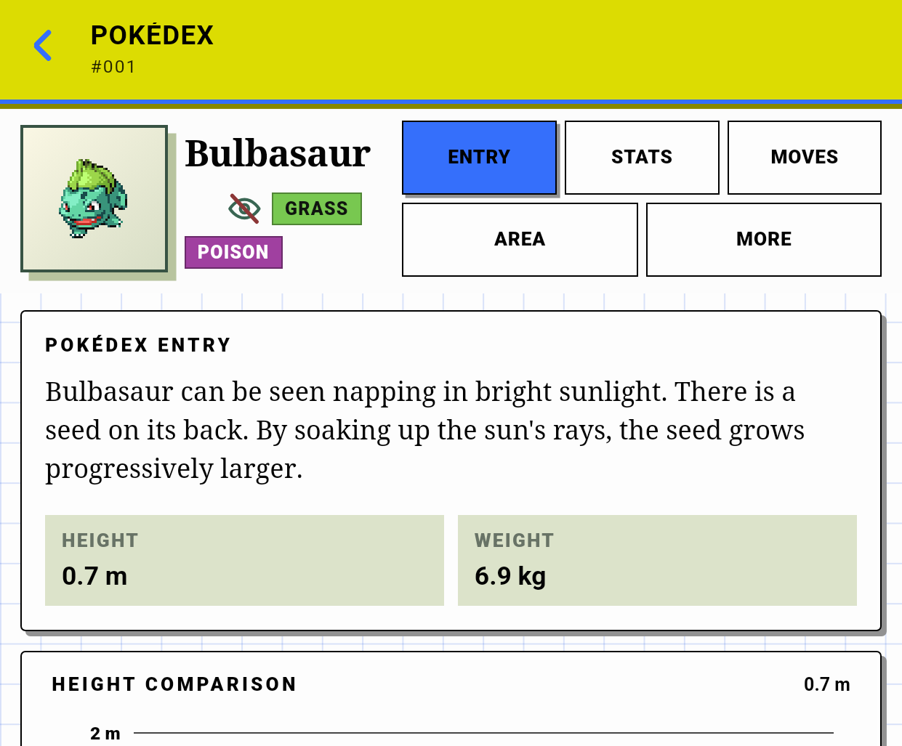
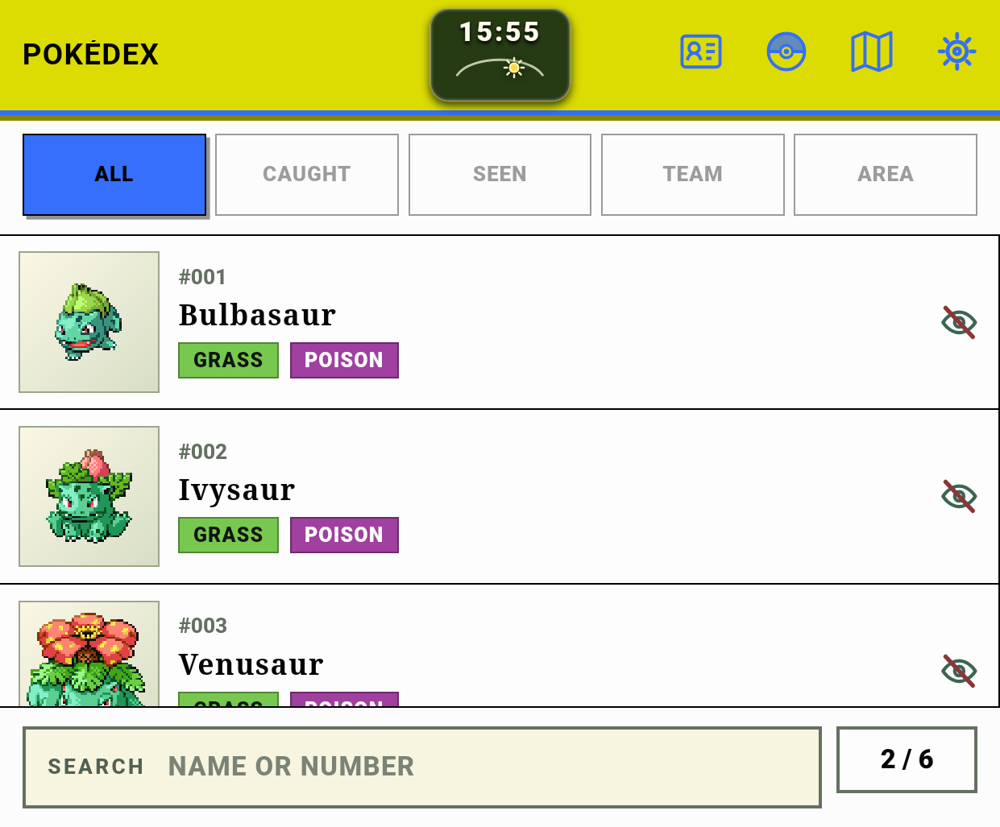
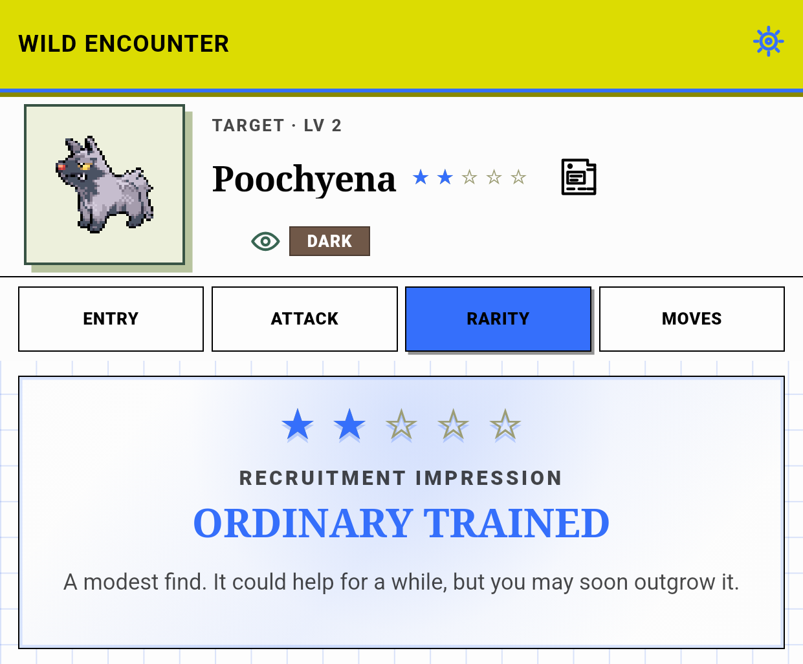
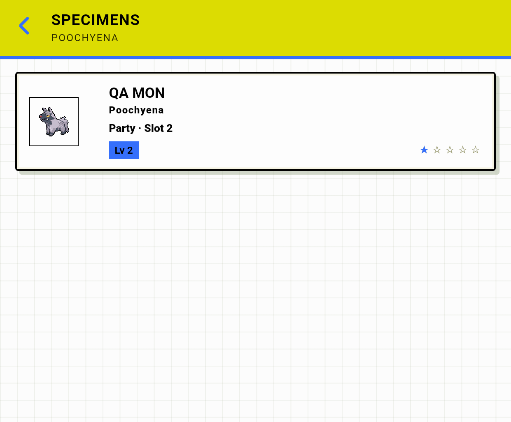

# Thor compact layout fix validation — 2026-08-30

Validated base checkpoint: `b33db3cb`

Debug APK SHA-256: `f078c6afbd4dfb2636df95f8d6c1c764d5ef530fe85d654acca3fc501271c2cb`

Machine-readable measurements and screenshot hashes are in [`evidence/thor-compact-layout-fix-2026-08-30/geometry.json`](evidence/thor-compact-layout-fix-2026-08-30/geometry.json).

## Scope

Task #287 was limited to the two compact Pokédex-detail defects proven by the prior APK analysis. The implementation:

- keeps the app header fixed;
- places identity, tabs, and detail content inside one compact vertical scroller;
- reduces only the compact identity grid from a `598px` intrinsic minimum to a width-safe `88px / minmax(120px, .7fr) / minmax(0, 2fr)` grid;
- retains two tab rows and a `44px` compact control-height floor;
- preserves the existing noncompact three-row screen and independent detail-content scroller through `display: contents`;
- does not modify Rarity, Specimens, or Pokédex-browse production styles.

## Browser regression

The new `538×445` Playwright regression first failed against the production defect with `.detail-screen.scrollWidth=598` for a `538px` client and no shared `.detail-scroll` owner. After the implementation, the focused file passed all three tests:

```text
3 passed (13.8s)
```

The focused static layout contract also passed all 16 tests. The Playwright server rebuilt the production web bundle before each run.

## Exact APK authority

The updated debug APK ran on the thread-owned `DualDexThorQaApi35` AVD on `emulator-5556`; the physical Thor and unrelated emulator were not accessed.

- Physical raster: `1240×1080`
- App-area overlay: `1240×1025` on capture-time display `3`
- Density: `369 dpi`
- Font scale: `0.95`
- WebView: `538×445` CSS px at DPR `2.3062500953674316`
- Visual viewport: `538.1029663085938×445.3116455078125`
- Exact Modern Emerald SHA-256: `21a0306c4e5b5dc15ca70b74e713e3140612c1045aa298072993a6c5dd8d6895`
- CRC32: `8C7DBECA`
- Production authority: `catalogReady=true`, `gameAccessReady=true`, `resolution=ACTIVE`, `indexedRoms=1`
- Knowledge mode: `DISCOVERED`

The catalog reopened from the retained QA cache. Task #294 separately tracks repeatable clean catalog preparation and remains outside this layout fix.

## Pokédex detail result



Horizontal containment now closes exactly:

- `.detail-screen`: client/scroll `538×445 / 538×445`
- `.detail-scroll`: client `538×383`, scroll `538×627`
- `.identity-card`: client/scroll `538×113 / 538×113`
- `.detail-content`: client/scroll `538×492 / 538×492`
- rightmost tab edge: `526.10px`, leaving approximately `12px` inside the viewport

The shared compact scroller accepted a requested `scrollTop=100` as `99.73`. The identity moved from `y=67.00` to `y=-32.73` and content moved from `y=189.99` to `y=90.26`, while the header remained at `y≈5.00`. Identity, tabs, and content therefore share one compact scroll path without moving the app header.

## Regression views



Pokédex browse remains one-column with screen client/scroll `538×445 / 538×445` and the same screenshot SHA-256 as the pre-fix APK.



Rarity remains bounded: `.battle-content` client/scroll `538×203 / 538×203`, and the card client/scroll height remains `182/182`. Its screenshot SHA-256 is unchanged.



The sanitized `QA MON`, `Poochyena`, `Party · Slot 2`, `Lv 2`, and rarity positions remain visible. Card client/scroll remains `503×101 / 503×101`, and its screenshot SHA-256 is unchanged.

The actual APK therefore closes both surviving compact Pokédex-detail defects without regressing the three already accepted views.
