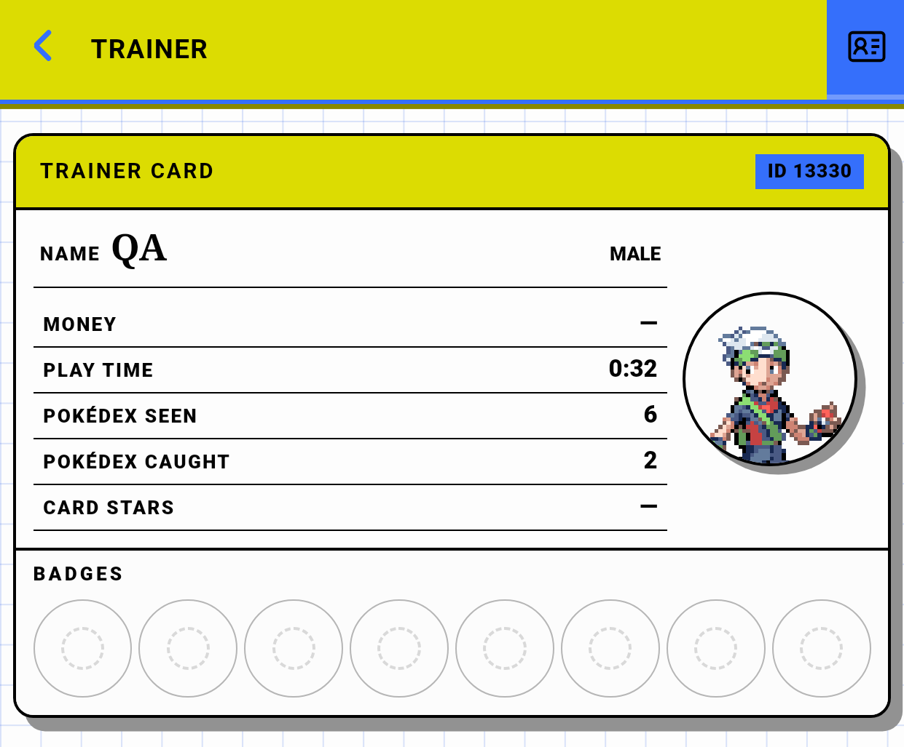
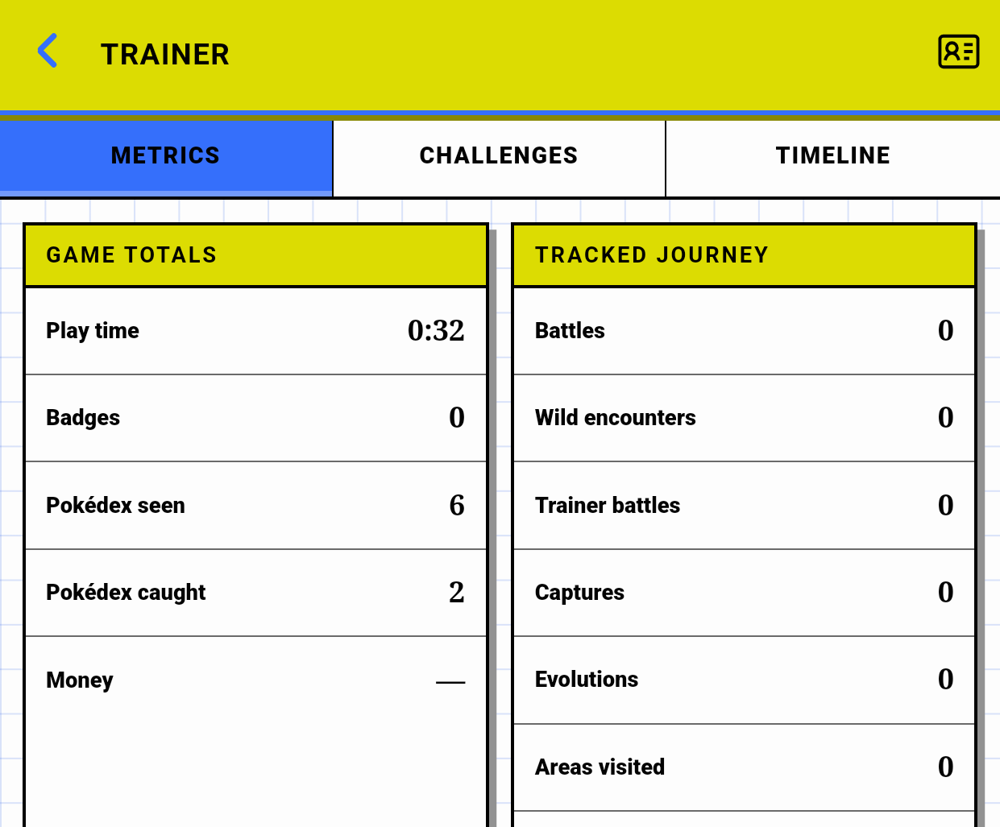
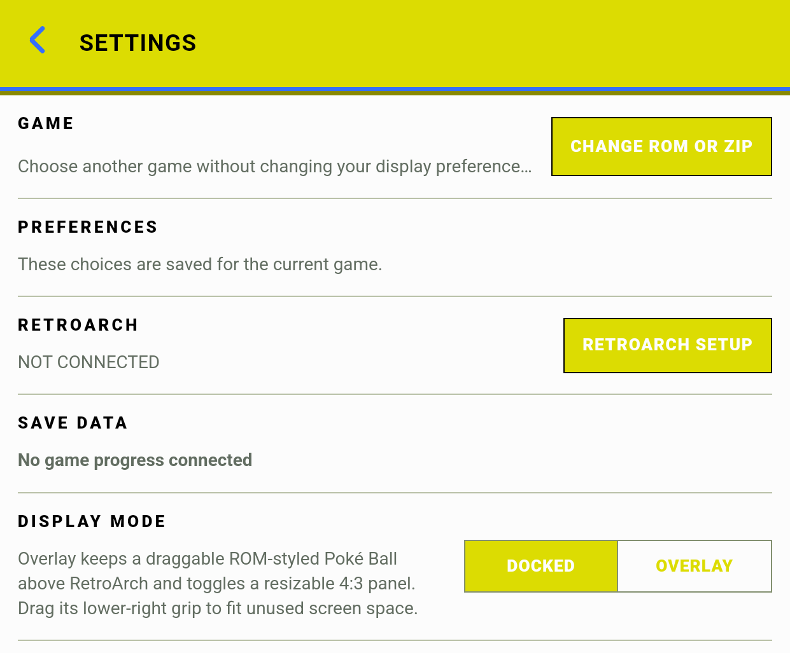
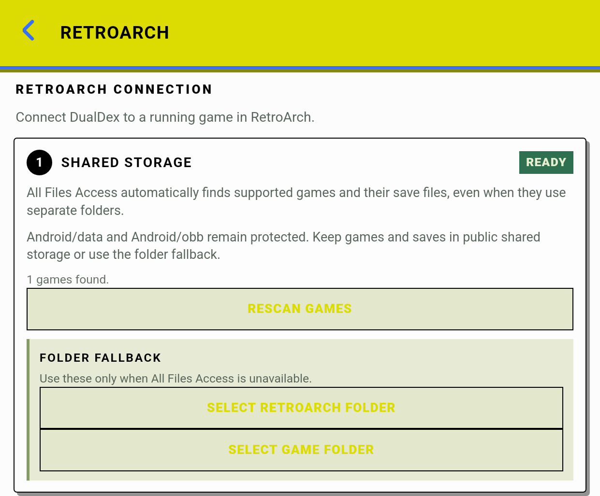
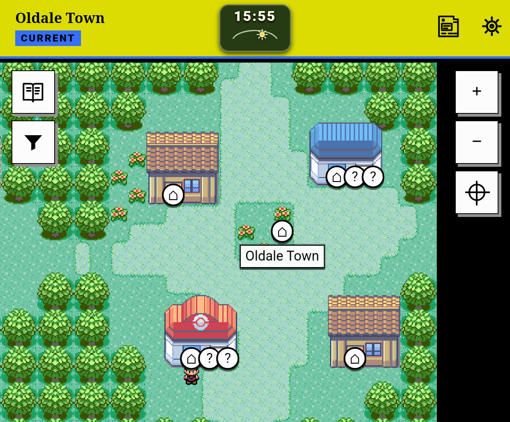
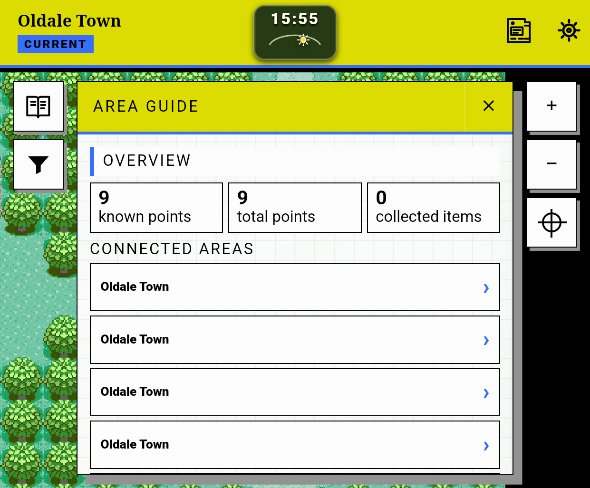
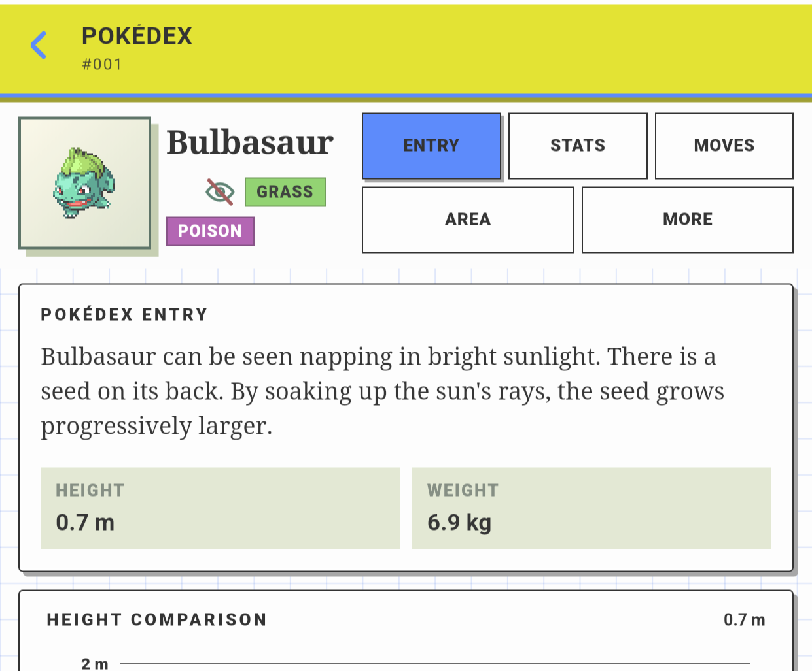
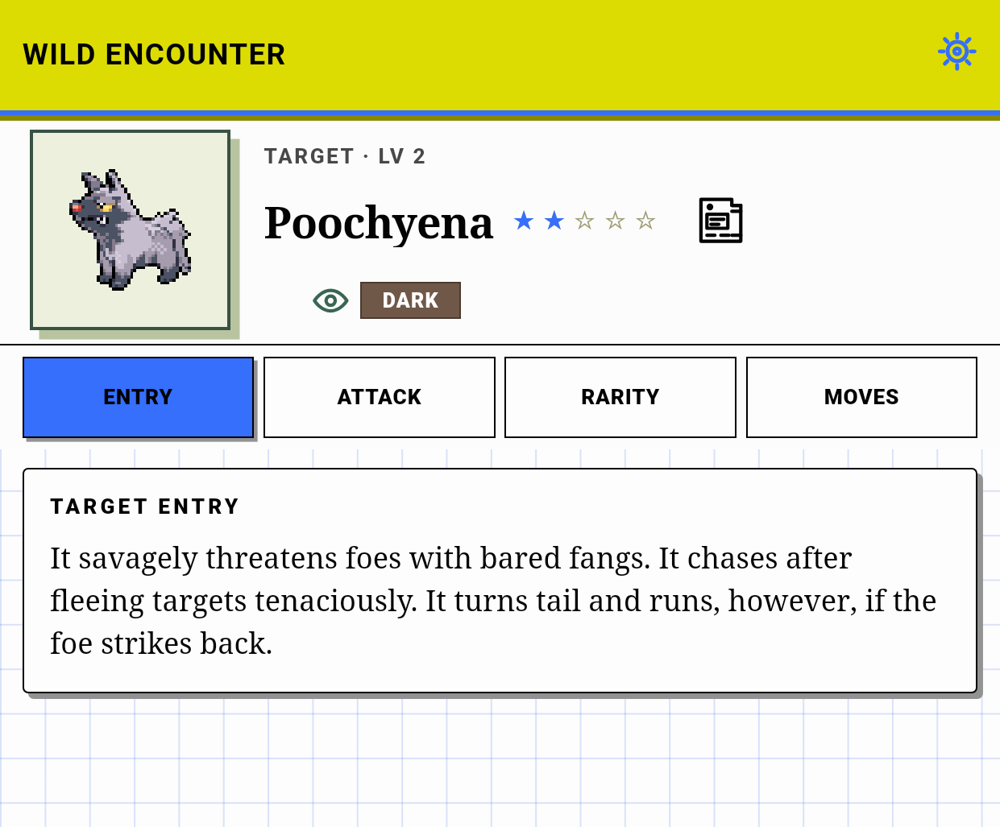
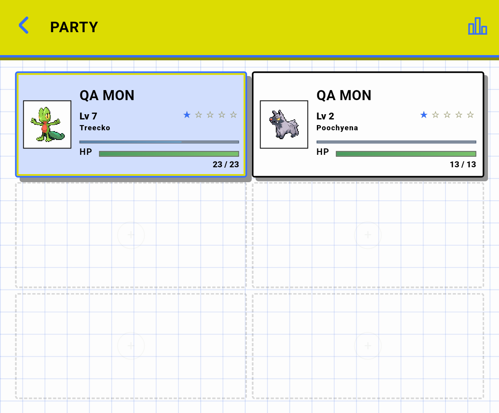

# Thor critical UI usability audit — 2026-08-30

Validated branch checkpoint: `4b7122ca`

Debug APK SHA-256: `f078c6afbd4dfb2636df95f8d6c1c764d5ef530fe85d654acca3fc501271c2cb`

Machine-readable measurements and screenshot hashes are in [`evidence/thor-ui-critic-2026-08-30/audit-summary.json`](evidence/thor-ui-critic-2026-08-30/audit-summary.json).

## Decision summary

No critical issue made the whole companion unusable and no data-loss path was observed. The audit found four high-priority usability defects:

1. **Trainer Progress is not reachable through the visible touch UI.**
2. **Modern Emerald theme colors make important Settings and RetroArch Setup actions nearly unreadable.**
3. **Map POIs are much smaller than the touch-target contract and overlap at shared locations.**
4. **Area Guide combines a constrained outer scroller with contained inner lists and presents duplicate, indistinguishable destinations.**

The best next UI batch is therefore not a visual redesign. It is a bounded correction of navigation reachability, contrast, map interaction, and compact scrolling. Browse density, Settings information architecture, modal behavior, accessibility semantics, and recovery affordances should follow as a second batch.

No production UI change was made during this audit.

## Trust boundary

The final visual evidence did **not** use Android's quarter-size overlay-display thumbnail. It used a full emulator-console multidisplay window with the Thor's complete raster:

- physical window: `1240×1080`;
- Android app area: `1240×1025` after the `55 px` navigation inset;
- density: `369 dpi`;
- font scale: `0.95`;
- packaged WebView: `538×445` CSS px at DPR `2.3062500953674316`;
- capture raster: `1241×1027`, from fractional WebView dimensions rounding outward.

The production `MainActivity`, WebView bundle, parser/catalog cache, session authority, raw-memory decoder, and runtime publication paths were active. Only the debug transport was replaced by the existing sanitized simulator.

Authority before capture:

- exact Modern Emerald `(v3.5).gba`;
- SHA-256 `21a0306c4e5b5dc15ca70b74e713e3140612c1045aa298072993a6c5dd8d6895`;
- CRC32 `8C7DBECA`;
- `catalogReady=true`;
- `gameAccessReady=true`;
- `resolution=ACTIVE`;
- `knowledgeMode=DISCOVERED`;
- `indexedRoms=1`.

Twenty-five scripted route/state captures covered Pokédex, all five detail tabs, Local Map, Area Guide, POI filters, Party, Party Analysis, Trainer Card and Progress, Settings, RetroArch Setup, Compatibility Report, all four battle tabs, Specimens, and specimen detail. The initial scripted capture named `02-detail-entry` had retained **MORE** as its selected tab; it was rejected and replaced with a targeted capture that asserts `activeTab=ENTRY`.

### Evidence labels

- **APK-measured:** reproduced and measured in the packaged app at exact Thor geometry.
- **Code-proven:** the production DOM/CSS establishes the mechanism without relying on visual judgment.
- **Strong hypothesis:** the mechanism is credible but the available live state could not exercise the complete interaction.
- **Preference:** a possible improvement without a demonstrated defect. Preferences are not ranked as blockers.

## Ranked findings

| Rank | Severity | Finding | Evidence | Recommended batch |
|---:|---|---|---|---|
| 1 | High | Trainer Progress destination is clipped outside the viewport | APK-measured + code-proven | A |
| 2 | High | Theme-derived action contrast fails basic readability | APK-measured + code-proven | A |
| 3 | High | Map POIs are undersized and overlap | APK-measured + code-proven | A |
| 4 | High | Area Guide has competing scroll ownership and indistinguishable exits | APK-measured + code-proven | A |
| 5 | Medium | Compact density does not reduce Pokédex row height | APK-measured + code-proven | B |
| 6 | Medium | Settings is a `2085 px` linear page with undersized actions | APK-measured + code-proven | B |
| 7 | Medium | Dialogs do not provide a complete modal/focus contract | Code-proven; one strong APK hypothesis | B |
| 8 | Medium | Selection, tabs, landmarks, and route focus are inconsistent | Code-proven | B |
| 9 | Medium | Empty, failure, and background-feedback states often lack direct recovery | Screenshot + code-proven | B |
| 10 | Low | A few compact layouts retain avoidable micro-scroll or unused space | APK-measured + code-proven | C |

## High-priority findings

### 1. Trainer Progress is outside the visible touch UI

The Trainer screen measures `538 px` client width but `588 px` scroll width. The header's action container is only `46 px` wide while its destination switcher requires `96 px`:

- `.header-actions`: client/scroll `46×59 / 96×59`;
- `.trainer-destination-switcher`: client/scroll `46×59 / 96×59`;
- screen and header: client/scroll width `538 / 588`.

The first `48 px` Card button occupies the visible slot. The second `48 px` Progress button begins beyond the right edge and is fully clipped by the screen. The audit script could open Progress only by programmatically clicking the offscreen DOM element; a touch user cannot discover or activate it.

Root cause: compact `.header-actions` uses `46 px` tracks while the nested switcher defines two `48 px` tracks, but the parent allocates only one action track. See `companion-web/src/styles.css:64`, `companion-web/src/styles.css:91-93`, and `companion-web/src/styles.css:312`.

**Proposed improvement:** allocate the Trainer destination switcher its full two-control width rather than nesting it in one generic action track. Retain the icons and selected-state treatment; this does not require a new navigation model.

**Trade-off:** the title receives approximately `50 px` less width. Its existing ellipsis behavior is preferable to hiding an entire destination.

**Acceptance:** at `538×445`, Card and Progress are both visible, each hit target is at least `44×44`, both switch by touch, and Trainer screen/header/action containers satisfy `scrollWidth <= clientWidth`.

### 2. Theme-derived action labels are nearly unreadable

The Modern Emerald theme is visually effective for headers and selected tabs because it uses dark text on the bright yellow surface. Several actions bypass that foreground relationship:

- Settings actions render approximately `#fcfcfc` on `#dcdc02`: contrast **1.43:1**;
- RetroArch Setup actions render approximately `#dcdc02` on `#e3e8cc`: contrast **1.17:1**.

Both are far below the `4.5:1` normal-text target, and the labels are visibly washed out in the exact APK.

Root cause: game-theme mode aliases semantic colors such as `--forest-800` to arbitrary ROM-derived surfaces, while Settings and Setup still assume that `--forest-*` is dark. For example, Settings uses `var(--paper)` on `var(--forest-800)` and Setup uses `var(--forest-800)` on a pale fixed background. See `companion-web/src/styles.css:478`, `companion-web/src/styles.css:488-490`, `companion-web/src/styles.css:500`, and `companion-web/src/styles.css:591-603`.

**Proposed improvement:** introduce contrast-checked semantic pairs such as `--action-bg`/`--action-fg`, `--surface-bg`/`--surface-fg`, and `--danger-bg`/`--danger-fg`. Derive black or white foregrounds from the resolved theme surface instead of assuming a ROM color is dark. Keep the source game's palette for surfaces and borders.

**Trade-off:** action text will not always use the raw game palette. Readability is more important than exact palette reuse for controls.

**Acceptance:** every bundled and catalog-derived theme meets `4.5:1` for normal action text, `3:1` for large text and non-text control boundaries, in both normal and high-contrast modes. Modern Emerald Settings and Setup must pass without requiring the user to enable High Contrast first.

### 3. Map POIs are too small and overlapping

Nine visible Local-map POI buttons each measure approximately `24×24 CSS px`. At the Mart and Pokémon Center, adjacent POI centers are only `19.17 px` apart, so their visible circles overlap by about `4.83 px`. Expanding each existing element to a `44 px` hit box without clustering would make the ambiguous overlap worse.

The same contract is weaker elsewhere: Atlas markers are `11×11`, habitat markers `17×17`, and a POI close control `26×26`. See `companion-web/src/styles.css:460` and `companion-web/src/styles.css:938-950`.

**Proposed improvement:**

1. preserve a compact inner glyph but give isolated markers a `44×44` interactive wrapper;
2. cluster POIs that share or nearly share coordinates into one `44×44` target;
3. open a compact list/sheet for the clustered POIs, preserving discovery-mode labels;
4. use the same target contract for Local, Atlas, and habitat maps.

**Trade-off:** selecting one POI in a dense location may require a second tap. That is safer than nine overlapping, ambiguous targets and keeps the map visually uncluttered.

**Acceptance:** every map control and marker has at least a `44×44` effective hit target; no two simultaneously actionable hit regions overlap; all nine Oldale POIs remain individually reachable; and TalkBack identifies both a cluster and its members.

### 4. Area Guide makes lower sections hard to reach and repeats destinations

At exact geometry, `.area-guide-content` has only `396×310 px` visible for `396×785 px` of content. Its header stays fixed, which is good. The content then introduces virtual lists up to `280 px` high with their own contained scrolling. A swipe that starts inside such a list cannot naturally continue the outer guide toward later sections such as Places, Items, and Objectives.

The top of the exact Oldale guide also shows four consecutive buttons all labelled **Oldale Town**. If these represent distinct exits, the UI gives no direction, coordinate, or exit number. If they share the same destination, they should not be four identical navigation choices.

See `companion-web/src/pages/AreaGuideDrawer.tsx:74-129`, `companion-web/src/pages/AreaGuideDrawer.tsx:185-221`, and `companion-web/src/styles.css:953-969`.

**Proposed improvement:** make the compact drawer body the single vertical gesture owner. Keep list windowing, but derive it from the outer scroll position, or use expandable sections whose rows participate in the outer flow. Group identical exits as one destination with an exit count; if distinct exits matter, label them by direction or map position.

**Trade-off:** outer-scroll virtualization is more involved than isolated list virtualization. A simpler expandable-section implementation may retain more DOM rows, but area lists are bounded and this is preferable if performance remains acceptable.

**Acceptance:** one continuous swipe path reaches Overview through Objectives; only one element owns vertical touch scrolling at a time; every connected-area row is uniquely identifiable; and the fixed drawer header/close control remain visible.

## Medium-priority findings

### 5. Compact density does not change browse throughput

The browse list has `254 px` of visible height and fixed `94 px` rows, so only about `2.7` entries are visible. Settings offers Auto, Comfortable, and Compact, but `PokedexBrowse.tsx` virtualizes with `SPECIES_ROW_HEIGHT = 94`; the compact CSS only changes `min-height` to `68 px`. The fixed virtual track still wins.

**Proposed improvement:** make row height an explicit density value shared by CSS and the virtualizer, for example Comfortable `94 px` and Compact `68 px`.

**Trade-off:** Compact must reduce sprite and secondary-copy prominence. It should remain optional; Comfortable can retain the current strong visual cards.

**Acceptance:** Compact produces `68 px` rows with no virtual gaps or overlaps after long scrolling and exposes at least 3.7 rows in the exact Thor list viewport. Comfortable remains visually unchanged.

### 6. Settings is too linear and several actions are undersized

Settings content measures `538×383 / 538×2085`, more than five viewports. Important setup, presentation, information-policy, readability, behavior, and diagnostic controls share one uninterrupted scroll path. Visible actions measure only `36-38 px` high:

- Change ROM: `38.27 px`;
- RetroArch Setup: `37.99 px`;
- Docked/Overlay: `36 px`;
- Setup folder and rescan actions: `37.99 px`.

The maintenance action **REMOVE UNUSED GAME DATA** is styled like read-only report/export actions, weakening action hierarchy even though it requires more caution.

**Proposed improvement:** use compact category navigation or collapsible groups; keep routine Game/RetroArch/Display controls prominent and move diagnostics/maintenance into an explicit Advanced section. Raise every action and toggle row to at least `44 px`; style maintenance separately from read-only actions.

**Trade-off:** category navigation adds a tap. It reduces scanning and accidental activation on a six-inch touch display.

**Acceptance:** all interactive rows are at least `44 px`; each setting is reachable from a labelled category without traversing five screens; routine and maintenance actions are visually distinct; and state persists across category changes.

### 7. Dialogs lack a complete modal contract

Party and Specimen detail windows have `role="dialog"` and `aria-modal="true"`, and Party supports Escape. Neither traps focus or marks background controls inert; Specimens does not handle Escape. Both use a clickable non-semantic backdrop. The close control is sticky within the detail window, which is worth preserving.

A stronger Specimens-specific risk remains: the overlay is absolutely positioned inside `.specimens-content`, which is itself the scroll owner. Opening a card after scrolling a multi-card list can anchor the overlay above the visible scrollport. The live Modern Emerald state had only one specimen, so this is a **strong hypothesis**, not an APK reproduction.

**Proposed improvement:** mount overlays against the screen viewport rather than inside list content; use one shared modal primitive with focus trap, inert background, Escape, labelled close, and focus restoration.

**Acceptance:** a synthetic long specimen list can be scrolled before opening any card; the dialog always fills the visible viewport; Tab/Shift+Tab stay inside; Escape and backdrop close consistently; and focus returns to the triggering card without changing list position.

### 8. Accessibility semantics are inconsistent

The shared Segmented control declares `tablist` and `tab`, but all tabs remain in sequential tab order, arrow-key behavior is absent, and tabs are not associated with tabpanels. Several selected controls rely only on visual classes: Pokédex filters, battle targets, map markers, and display mode do not consistently expose `aria-pressed`, `aria-current`, or equivalent state. Shared page titles are `<strong>` rather than headings, and route changes do not intentionally move focus.

**Proposed improvement:** add a small shared contract rather than screen-specific patches:

- roving `tabIndex` and arrow keys for true tablists;
- `aria-controls`/`tabpanel` associations;
- `aria-pressed` or `aria-current` for non-tab selection;
- one `<h1>` per route;
- focus the route heading on forward/back navigation without stealing focus during live updates.

**Trade-off:** external-keyboard behavior adds implementation and regression surface, but the DOM becomes more predictable for TalkBack as well.

**Acceptance:** TalkBack announces current state, heading navigation identifies every route, and keyboard tab/arrow behavior follows the ARIA pattern without changing touch behavior.

### 9. Recovery and feedback rarely provide the next action

Examples visible or code-proven in this audit:

- **MOVE LIST NOT READY** instructs the user to choose a list in Settings but offers no direct Settings action;
- specimen refresh failure has no Retry;
- global error toast has no dismiss or retry action and can cover bottom controls;
- the loading badge can occupy header-action space;
- **NO HABITAT MAP** explains absence but offers no useful fallback when one exists.

**Proposed improvement:** treat every terminal empty/failure state as `message + reason + next action`. Add direct navigation to the exact relevant setting, bounded Retry where safe, and an Atlas/Area Guide fallback where supported. Make passive background status non-blocking and reserve space instead of covering controls.

**Acceptance:** each recoverable failure has one obvious action; terminal unsupported states say that no action is available; toasts never intercept underlying controls; and loading feedback cannot cover a header destination.

## Low-priority polish

- Battle Attack content measures `538×203 / 538×222`, producing an avoidable `19 px` micro-scroll just to reveal the bottom of the effectiveness card. A small compact-spacing reduction should fit this exact state without changing Entry or Rarity.
- Long map names can extend beneath the absolutely centered `76 px` clock because the location block does not reserve the clock's x-range. Test the longest ROM-derived names and truncate before collision.
- Nearby-move cards use a three-column development grid but render only two children, leaving the flexible target column unused. Give nearby moves a dedicated two-column variant.
- Several Party and Setup labels reach the `11.2 px` floor or below through responsive clamps. Physical-Thor validation at `85%`, `100%`, and `135%` font scale should precede any typography reduction.

These do not justify delaying the high-priority batch.

## Views that should be preserved

The audit also found strong existing layouts. Improvements should be regression-bounded rather than broad restyling.

### Pokédex detail

The corrected compact detail is readable, horizontally contained, and uses the full `538×383` content region as one shared scroll path. Its identity/tabs/content architecture should remain.

### Battle

Entry has a clear hierarchy and Rarity fits without semantic clipping or vertical scrolling. Rarity's larger DOM `scrollWidth` remains a clipped decorative pseudo-element, not a content defect.

### Party and Specimens

Party uses the landscape space well, keeps empty slots understandable, and exposes both live members clearly. The available specimen card preserves nickname, species, location, level, and rarity without truncation.

## Recommended implementation sequence

### Batch A — unblock touch use

1. expose both Trainer destinations;
2. introduce contrast-safe semantic action colors;
3. cluster map POIs and enforce `44 px` hit regions;
4. give Area Guide one compact scroll owner and meaningful exit labels.

This is the smallest batch that removes inaccessible or error-prone core interactions.

### Batch B — improve navigation and accessibility

1. make density real in CSS and virtualization;
2. reorganize Settings and raise compact control heights;
3. introduce a shared modal contract;
4. normalize tab, selected-state, heading, and route-focus semantics;
5. add direct recovery actions.

### Batch C — polish

1. remove Battle Attack's micro-scroll;
2. reserve clock space for long map names;
3. correct nearby-move card columns;
4. validate text sizes on the physical Thor.

## Limitations

- This was an exact packaged-APK emulator audit, not a physical finger-reach, glare, or TalkBack session on the Thor.
- The live sanitized state contained two party members and one specimen; the scrolled Specimens overlay risk therefore remains a code-backed hypothesis.
- A Compatibility Report screenshot initially caught its legitimate asynchronous loading state. It was inspected after loading but was not used to rank a layout defect.
- No parser or corpus code changed, so the parser corpus was intentionally not rerun.
- Stable promotion remains subject to the existing signed-candidate lower-display confirmation gate.
