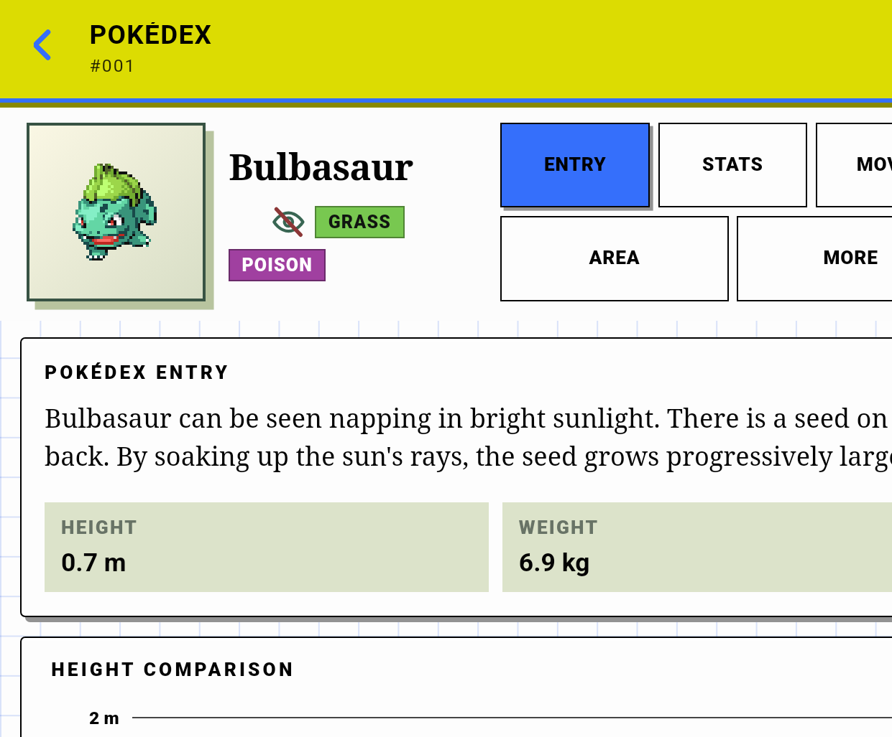

# Thor emulator usability analysis — 2026-08-30

Validated branch checkpoint: `928fee8e`

Validated APK source checkpoint: `4efbd188`

APK: `D:\Temp\dualdex-qa-4efbd188-debug.apk` (`com.darkaxt.dualdex.debug`)

This analysis used the production `MainActivity`, Android loopback server, WebView bundle, parser/catalog cache, session authority, raw-memory decoder, runtime publication, and UI. Only the debug `NetworkCommandTransport` was replaced. No production layout was changed during this analysis.

Machine-readable measurements and screenshot hashes are in [`evidence/thor-usability-2026-08-30/geometry.json`](evidence/thor-usability-2026-08-30/geometry.json).

## Trust boundary

Only the thread-owned `DualDexThorQaApi35` AVD on `emulator-5556` was used. The physical Thor and the unrelated emulator were not accessed.

Production authority was active before UI findings were recorded:

- `catalogReady=true`
- `gameAccessReady=true`
- `knowledgeMode=DISCOVERED`
- `retroArch.connection=PAUSED`
- `retroArch.resolution=ACTIVE`
- `retroArch.activeSource="Modern Emerald (v3.5).gba"`
- `retroArch.contentCrc32=8C7DBECA`
- `retroArch.contentSha256=21a0306c4e5b5dc15ca70b74e713e3140612c1045aa298072993a6c5dd8d6895`
- `retroArch.indexedRoms=1`

The overworld state published area `10`, position `(6,17)`, clock `15:55`, and two occupied party slots. Stepping the application-owned simulator once published the exact sanitized `battle-start` frame and a wild level-2 Poochyena through the production decoder.

## Exact geometry

Android geometry:

- Physical raster: `1240×1080`
- App-area overlay: `1240×1025`, `369 dpi`
- Font scale: `0.95`
- Capture-time overlay display ID: `2` (the ID is dynamic; geometry is authoritative)

Packaged WebView geometry:

- `innerWidth=538`
- `innerHeight=445`
- `devicePixelRatio=2.3062500953674316`
- `visualViewport.width=538.1029663085938`
- `visualViewport.height=445.3116455078125`
- `orientation=landscape-primary`
- `(max-width: 680px)=true`

`Page.captureScreenshot` emitted `1241×1027` PNGs because Chrome rounded the fractional visual viewport multiplied by DPR. This is a capture-boundary rounding artifact; the Android overlay and WebView metrics above remained exact.

## Findings

### Confirmed production defect: Pokédex detail clips horizontally

The detail screen has a `538 px` client width but a `598 px` scroll width. Its root uses hidden overflow, so approximately `59.88 CSS px` (`≈138 physical px`) are clipped rather than exposed through horizontal scrolling.

The cause is the production identity grid in `companion-web/src/styles.css`: `108px + minmax(150px, .7fr) + minmax(280px, 2fr) + 28px` of gaps + `32px` of horizontal padding requires exactly `598px`. There is no compact override for the measured `538px` WebView.

Measured consequences:

- `.identity-card`: `597.98×132` at `x=0`
- detail tabs: `x=301.99`, width `280`; the **MOVES** and **MORE** controls end at `x=581.99`
- `.detail-content`: `597.98×251.31`
- entry copy and the Weight fact extend approximately `33 CSS px` beyond the viewport
- the screenshot visibly cuts the right side of controls and content

This is not a browser-POC mismatch or a screenshot artifact. It is produced by the packaged APK at the accepted Thor metrics.

### Confirmed production defect: Pokédex detail owns scroll too low in the hierarchy

The document and body are fixed at `538×445` with `scrollHeight=445`. Attempts to set their scroll position to `100` remained at `0`. Only `.detail-content` scrolls:

- client: `598×251`
- scroll extent: `598×491`
- setting `scrollTop=200` produced `199.89`
- the header, `132px` identity/sprite block, and two-row tabs remain fixed while only content below `y=194` moves

The visible content scroller therefore receives only `251px` of the `445px` viewport. The reported behavior that scrolling does not move the whole detail page is reproduced in the APK. Task #287 should give the compact detail view one coherent vertical scroll owner (while retaining any deliberately fixed app header) and remove nested horizontal overflow.

### Pre-existing fix verified: battle Rarity no longer adds vertical scrolling

The exact battle view measured:

- opponent identity: `y=62`, height `124`
- four-tab row: `y=186`, height `55.99`
- `.battle-content`: client `538×203`, scroll `538×203`
- `.rarity-card`: `514.11×183.33`, ending at `y=435.32` inside the `445.31px` visual viewport
- card client/scroll heights: `182/182`

All semantic children remain inside the card. Its larger reported `scrollWidth` comes from the intentionally transformed, clipped decorative pseudo-element; text, stars, and labels do not clip. The current `981e1d84` Rarity changes therefore pass the actual Thor APK gate.

### Pre-existing fix verified: Specimens labels are no longer truncated

The packaged page used the raw party specimen for Poochyena and rendered the sanitized nickname, species, source, level, and rarity stars:

- page client/scroll: `538×445 / 538×445`
- content client/scroll: `538×383 / 538×383`
- card: `506.11×104.37`, client/scroll `503×101 / 503×101`
- copy region: client/scroll `393×53 / 393×53`
- metadata region: client/scroll `393×19 / 393×19`

`QA MON`, `Poochyena`, `Party · Slot 2`, `Lv 2`, and all five rarity-star positions are visible without ellipsis or overflow. The current `981e1d84` one-column card changes pass the actual Thor APK gate for the available sanitized live specimen.

### Pokédex browse is correctly one-column and unclipped

The APK does not reproduce the old three-column POC error:

- one `538.1px`-wide row per species
- row height `94px`
- no semantic horizontal overflow or text truncation
- `.species-list` is the sole list scroller: client `538×254`, scroll `538×40232`
- fixed search/count dock: `64.86px` high

Approximately 2.7 rows are visible at once. That is a density trade-off, not a clipping or scroll-ownership failure in the current acceptance scope.

## Harness defect discovered during cold setup

A clean install did not reproduce the earlier warm-cache startup. The stock AVD app growth limit was `192m`; exact Modern Emerald first-time catalog preparation repeatedly exhausted it around `TRAINER_AND_THEME`, with ART reporting allocations against a `201326592`-byte growth limit before the process died. The earlier successful run had retained a prepared catalog, masking the cold-start constraint.

For this analysis only, the owned emulator's `dalvik.vm.heapgrowthlimit` was set to `512m` and the Android runtime was restarted. The same tested APK then completed all 11 catalog stages and reopened the cache under exact production authority. No source, APK manifest, release behavior, or UI CSS was changed. WebView geometry remained exact after the runtime restart.

This is a QA provisioning defect, not a layout finding. It is tracked as Task #294 with acceptance requiring clean startup without a manual property override and unchanged release isolation.

## Task #287 acceptance derived from the APK

The compact-layout implementation should be limited to the two surviving Pokédex-detail defects:

1. At the accepted `538×445` WebView geometry, every detail-screen container must have `scrollWidth <= clientWidth`; all five tabs and content cards must remain fully visible.
2. The compact detail view must provide one coherent vertical content scroll path so the identity block does not permanently consume `194px` while only the lower `251px` region scrolls.
3. Preserve the verified one-column browse and Specimens layouts and the non-scrolling Rarity layout.
4. Re-run these four APK captures against exact Modern Emerald authority after the fix; browser-only evidence is insufficient.
